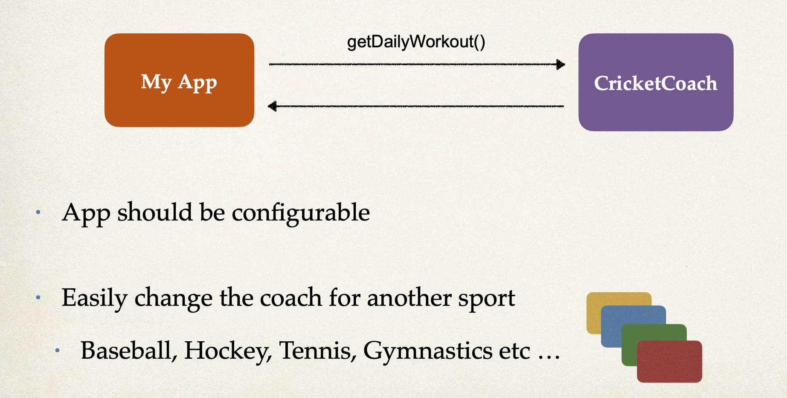
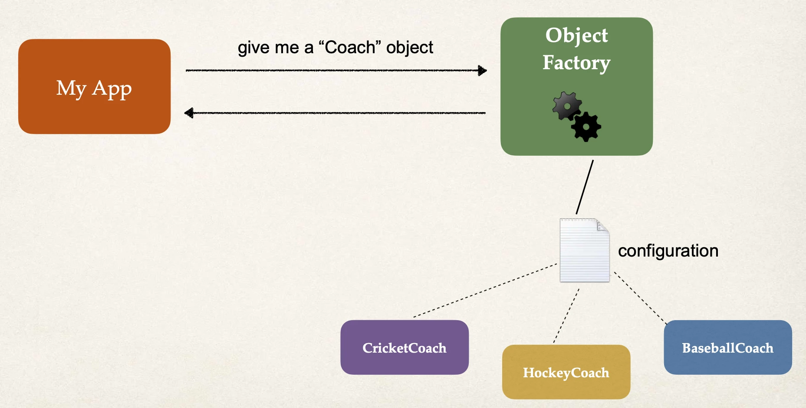
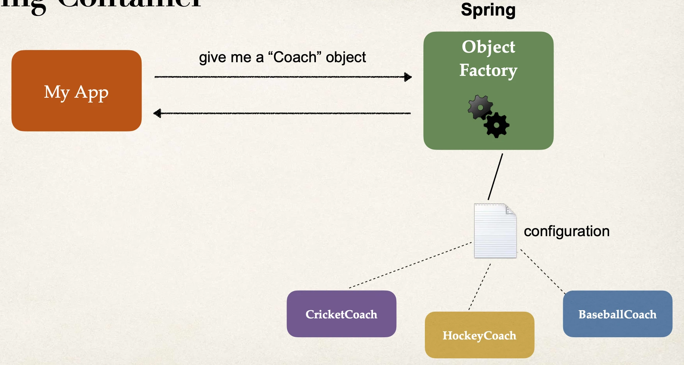

# What is Inversion of Control?

## Inversion of Control (IoC)

- The approach of outsourcing the
  construction and management of objects.

## Coding Scenario

## Ideal Solution

## Spring Container

### Primary Functions

- Create and manage objects (Inversion of Control)
- Inject object dependencies (Dependency Injection)

### Configuring Spring Container

- XML configuration file (legacy)
- Java Annotations (modern)
- Java Source Code (modern)
