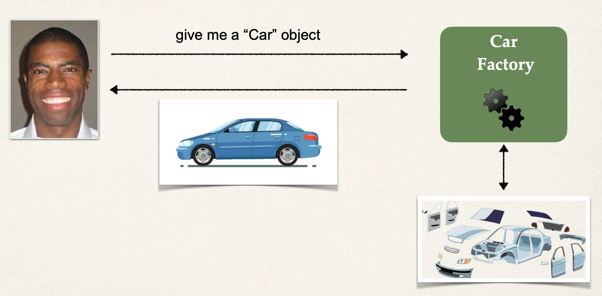
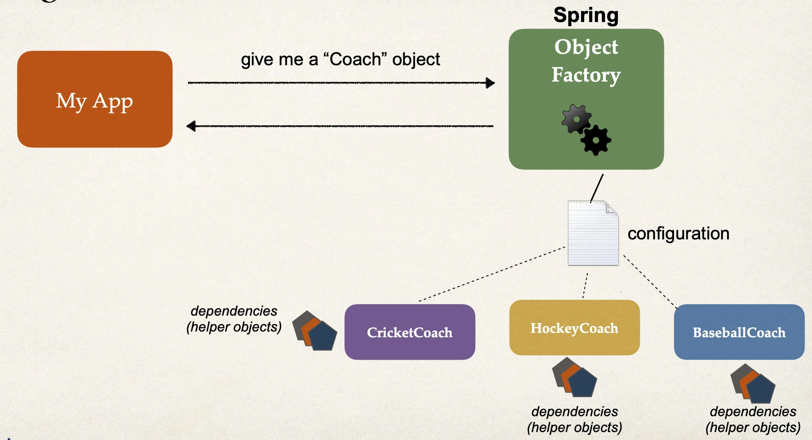

# Defining Dependency Injection - Overview Part 1

## Dependency Injection

- The dependency inversion principle.
- The client delegates to another object the responsibility of providing its dependencies.

## Car Factory

## Spring Container

### Primary functions

- Create and manage objects (_Inversion of Control_)
- Inject object’s dependencies (_Dependency Injection_)

## Demo Example

- **Coach** will provide daily workouts
- The `DemoController` wants to use a **Coach**
  - New helper: **Coach**
  - This is a _dependency_
- Need to inject this dependency

## Injection Types

- There are multiple types of injection with Spring
- We will cover the two recommended types of injection
  - Constructor Injection
  - Setter Injection

## Injection Types - Which one to use?

Constructor Injection

- Use this when you have required dependencies
- Generally recommended by the spring.io development team as first choice

Setter Injection

- Use this when you have optional dependencies
- If dependency is not provided, your app can provide reasonable default logic

## What is Spring AutoWiring

- For dependency injection, Spring can use autowiring
- Spring will look for a class that matches
  - _matches by type_: class or interface
- Spring will inject it automatically … hence it is autowired

### Autowiring Example

- Injecting a **Coach** implementation
- Spring will scan for `@Components`
- Any one implements the **Coach** interface???
- If so, let’s inject them. For example: `CricketCoach`
