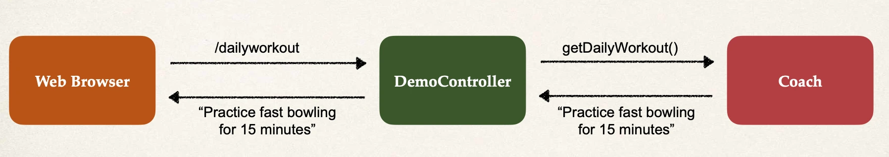

# Defining Dependency Injection - Overview Part 2

## Example Application



## Development Process - Constructor Injection

1. Define the dependency interface and class
2. Create Demo REST Controller
3. Create a constructor in your class for injections
4. Add `@GetMapping` for `/dailyworkout`

### Step 1: Define the dependency interface and class

`Coach.java`:

```java
package com.luv2code.springcoredemo;

public interface Coach {
    String getDailyWorkout();
}
```

`CricketCoach.java`:

- `@Component` annotation marks the class as a Spring Bean:

```java
package com.luv2code.springcoredemo;

import org.springframework.stereotype.Component;

@Component
public class CricketCoach implements Coach {

    @Override
    public String getDailyWorkout() {
        return "Practice fast bowling for 15 minutes";
    }
}
```

#### `@Component` annotation

- `@Component` marks the class as a Spring Bean
  - A Spring Bean is just a regular Java class that is managed by Spring
- `@Component` also makes the bean available for dependency injection

### Step 2: Create Demo REST Controller

`DemoController.java`:

```java
package com.luv2code.springcoredemo;

import org.springframework.web.bind.annotation.RestController;

@RestController
public class DemoController {

}
```

### Step 3: Create a constructor in your class for injections

`DemoController.java`:

- `@Autowired` annotation tells Spring to inject a dependency
- If you only have one constructor then `@Autowired` on constructor is optional
- At the moment, we only have one Coach implementation: `CricketCoach`.
  - Spring can figure this out.
  - Later in the course we will cover the case of multiple Coach implementations.

```java
package com.luv2code.springcoredemo;

import org.springframework.beans.factory.annotation.Autowired;
import org.springframework.web.bind.annotation.RestController;

@RestController
public class DemoController {

    private Coach myCoach;

    @Autowired
    public DemoController(Coach theCoach) {
        myCoach = theCoach;
    }
}
```

### Step 4: Add @GetMapping for /dailyworkout

`DemoController.java`:

```java
package com.luv2code.springcoredemo;

import org.springframework.beans.factory.annotation.Autowired;
import org.springframework.web.bind.annotation.GetMapping;
import org.springframework.web.bind.annotation.RestController;

@RestController
public class DemoController {

    private Coach myCoach;

    @Autowired
    public DemoController(Coach theCoach) {
        myCoach = theCoach;
    }

    @GetMapping("/dailyworkout")
    public String getDailyWorkout() {
        return myCoach.getDailyWorkout();
    }
}
```
