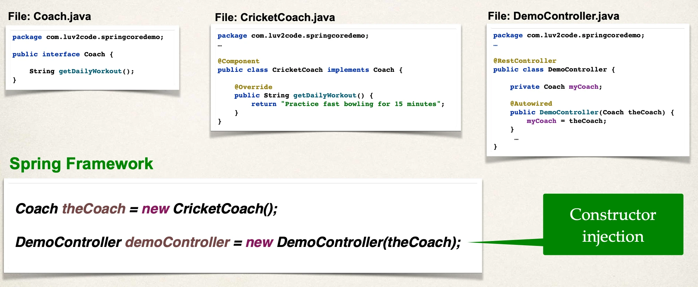

# Constructor Injection Behind the Scenes

- The Spring Framework will perform operations behind the scenes for you :-)

## How spring Processes Your Application

## The “new” keyword … is that it???

- You may wonder …
  - _Is it just the “new” keyword???_
  - _I don’t need Spring for this … I can do this by myself LOL!!!_
- Spring is more than just Inversion of Control and Dependency Injection
- For small basic apps, it may be hard to see the benefits of Spring

## Spring for Enterprise applications

- Spring is targeted for enterprise, real-time / real-world applications
- Spring provides features such as
  - Database access and Transactions
  - REST APIs and Web MVC
  - Security
  - etc …

- Later in the course, we will build a real-time CRUD REST API with database access.
- You will see the Spring features in action.
- Good things are coming :-)
