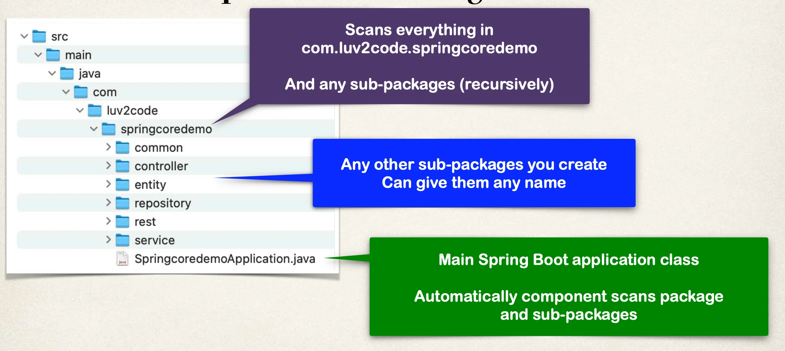
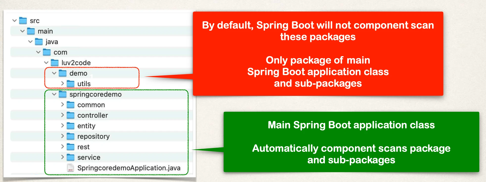

# Component Scanning - Overview

Scanning for Component Classes

- Spring will scan your Java classes for special annotations
  - `@Component`, etc …
- Automatically register the beans in the Spring container

## Java Source Code

File: `SpringcoredemoApplication.java`:

```java
package com.karani.springcoredemo;

import org.springframework.boot.SpringApplication;
import org.springframework.boot.autoconfigure.SpringBootApplication;

@SpringBootApplication
public class SpringcoredemoApplication {

	public static void main(String[] args) {
		SpringApplication.run(SpringcoredemoApplication.class, args);
	}

}
```

`@SpringBootApplication` Enables:

- Auto configuration
- Component scanning
- Additional Configuration

`@SpringBootApplication` Is composed of the following annotations:

- `@EnableAutoConfiguration`
- `@ComponentScan`
- `@Configuration`

### Annotations

`@SpringBootApplication` is composed of the following annotations:

| Annotation               | Description                                                                        |
| ------------------------ | ---------------------------------------------------------------------------------- |
| @EnableAutoConfiguration | Enables Spring Boot's auto-configuration support                                   |
| @ComponentScan           | Enables component scanning of current package. Also recursively scans sub-packages |
| @Configuration           | Able to register extra beans with `@Bean` or import other configuration classes    |

### Java Source Code: `SpringApplication.run(...)`

- Bootstraps your Spring Boot application

Behind the Scenes:

- Creates application context and registers all beans
- Starts the embedded server (Tomcat) etc ...

## More on Component Scanning

- By default, Spring Boot starts component scanning
  - From same package as your main Spring Boot application
  - Also scans sub-packages recursively
- This implicitly defines a base search package
  - Allows you to leverage default component scanning
  - No need to explicitly reference the base package name



## Common Pitfall - Different Location



## More on Component Scanning

Default scanning is fine if everything is under

- `com.luv2code.springcoredemo`

But what about my other packages?

- `com.luv2code.util`
- `org.acme.cart`
- `edu.cmu.srs`

Explicitly list base packages to scan:

```java
package com.luv2code.springcoredemo;
// …
@SpringBootApplication(
  scanBasePackages={"com.luv2code.springcoredemo",
                    "com.luv2code.util",
                    "org.acme.cart",
                    "edu.cmu.srs"})
public class SpringcoredemoApplication {
 …
}
```
