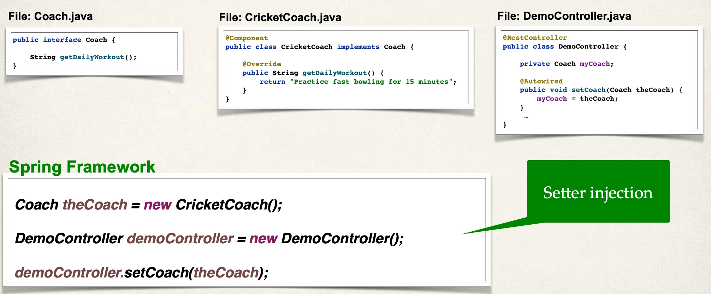

# Setter Injection - Overview

Spring Injection Types

- Constructor Injection
- Setter Injection: Inject dependencies by calling setter method(s) on your class

## Autowiring Example

- Injecting a Coach implementation
- Spring will scan for `@Components`
- Any one implements the Coach interface???
- If so, let’s inject them. For example: `CricketCoach`

## Development Process - Setter Injection

1. Create setter method(s) in your class for injections
2. Configure the dependency injection with `@Autowired` Annotation

### Step 1: Create setter method(s) in your class for injections

`DemoController.java`:

```java
@RestController
public class DemoController {

    private Coach myCoach;

    public void setCoach(Coach theCoach) {
        myCoach = theCoach;
    }

    ...
}
```

### Step 2: Configure the dependency injection with Autowired Annotation

File: `DemoController.java`:

```java
@RestController
public class DemoController {

    private Coach myCoach;

    @Autowired
    public void setCoach(Coach theCoach) {
        myCoach = theCoach;
    }

    ...
}
```

## Cont.d

- The Spring Framework will perform operations behind the scenes for you :-)

## How spring Processes Your Application



- Inject dependencies by calling ANY method on your class
- Simply give: `@Autowired`

`DemoController.java`:

- You can give any method name, for example:

```java
@RestController
public class DemoController {

    private Coach myCoach;

    @Autowired
    public void doSomeStuff(Coach theCoach) {
        myCoach = theCoach;
    }

    ...
}
```

## Injection Types - Which one to use?

Constructor Injection

- Use this when you have required dependencies
- Generally recommended by the spring.io development team as first choice

Setter Injection

- Use this when you have optional dependencies
- If dependency is not provided, your app can provide reasonable default logic
