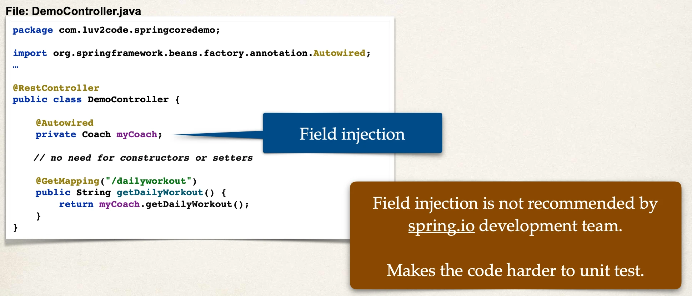

# Field Injection

Field Injection with Annotations and Autowiring

## Spring Injection Types

Recommended by the spring.io development team

- Constructor Injection: required dependencies
- Setter Injection: optional dependencies

Not recommended by the spring.io development team

- Field Injection

## Field Injection … no longer cool

- In the early days, field injection was popular on Spring projects
  - In recent years, it has fallen out of favor
- In general, it makes the code harder to unit test
- As a result, the spring.io team does not recommend field injection
  - However, you will still see it being used on legacy projects

It's basic idea is to:

- Inject dependencies by setting field values on your class directly (even private fields)
- Accomplished by using Java Reflection

## Step 1: Configure the dependency injection with Autowired Annotation

