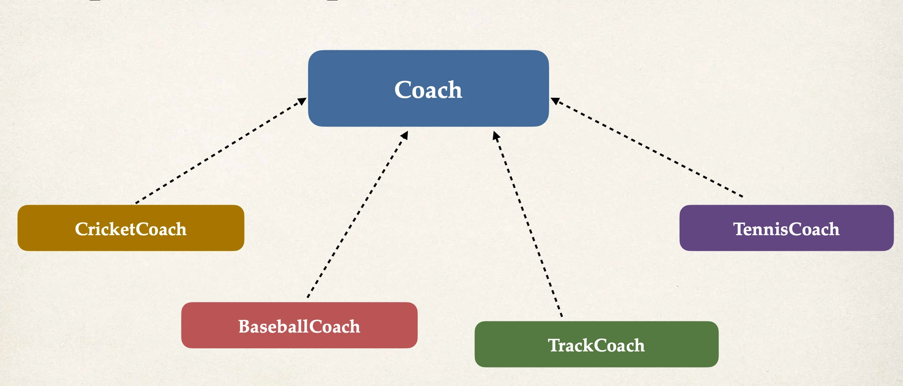
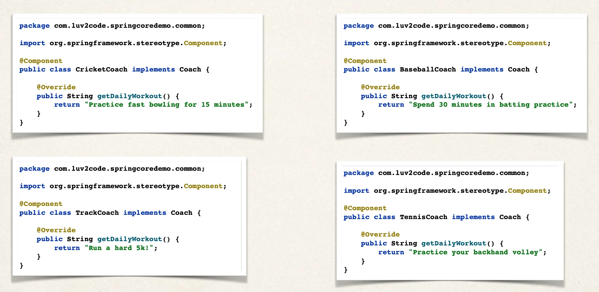
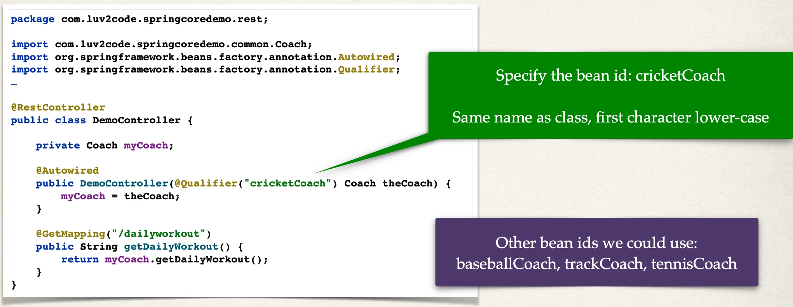
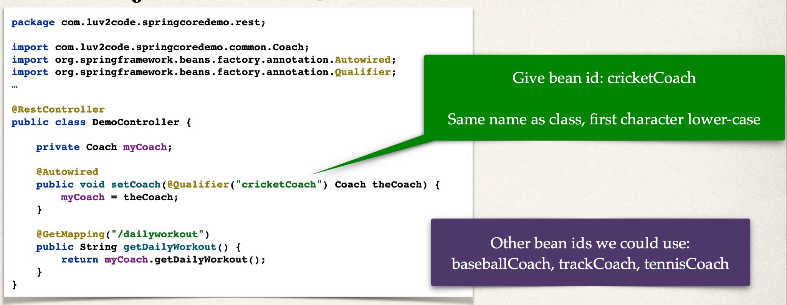

# Qualifiers - Overview

Annotation Autowiring and Qualifiers

## Autowiring

- Injecting a Coach implementation?
- Spring will scan @Components
- Any one implements Coach interface???
- If so, let’s inject them … _oops which one?_

## Multiple Coach Implementations



### Which to pick?



## Umm, we have a little problem ….

We'll see the error:

```
Parameter 0 of constructor in com.luv2code.springcoredemo.rest.DemoController
required a single bean, but 4 were found:
- baseballCoach
- cricketCoach
- tennisCoach
- trackCoach
…
```

## Solution: Be specific! - @Qualifier



## For Setter Injection

- If you are using Setter injection, can also apply @Qualifier annotation

## Setter Injection - @Qualifier


