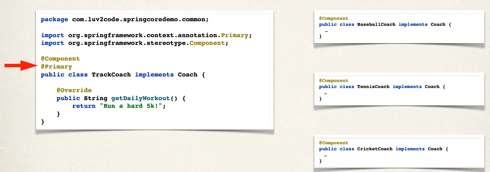
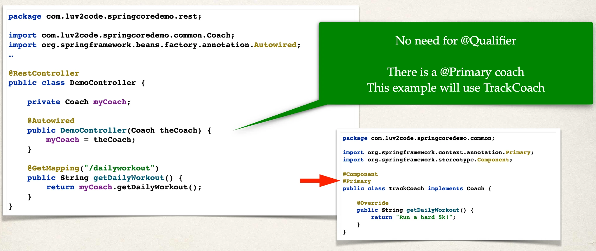
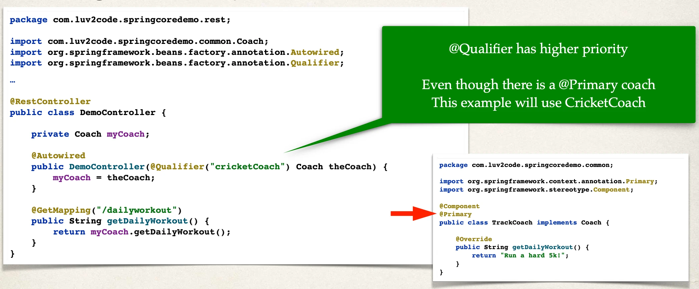

# Primary - Overview

`@Primary` annotation

## Resolving issue with Multiple Coach implementations

- In the case of multiple Coach implementations
  - We resolved it using @Qualifier
  - We specified a coach by name
- Alternate solution available …

## Alternate solution

- Instead of specifying a coach by name using @Qualifier
- I simply need a coach … I don’t care which coach
  - If there are multiple coaches
  - Then you coaches figure it out … and tell me who’s the **primary** coach

## Multiple Coach Implementations



## Resolved with `@Primary`



## `@Primary` - Only one

- When using `@Primary`, can have **only one** for multiple implementations
- If you mark multiple classes with `@Primary` … umm, we have a problem

```
Unsatisfied dependency expressed through constructor parameter 0:
No qualifying bean of type 'com.luv2code.springcoredemo.common.Coach' available:
more than one 'primary' bean found among candidates:
[baseballCoach, cricketCoach, tennisCoach, trackCoach]
…
```

## Mixing `@Primary` and `@Qualifier`

- If you mix `@Primary` and `@Qualifier`
- `@Qualifier` has higher priority



## Which one: `@Primary` or `@Qualifier`?

- `@Primary` leaves it up to the implementation classes
  - Could have the issue of multiple `@Primary` classes leading to an error
- `@Qualifier` allows to you be very specific on which bean you want
- In general, I recommend using `@Qualifier`
  - Is More specific
  - Has Higher priority
