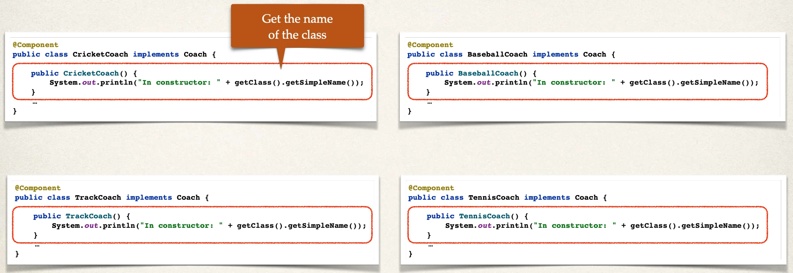
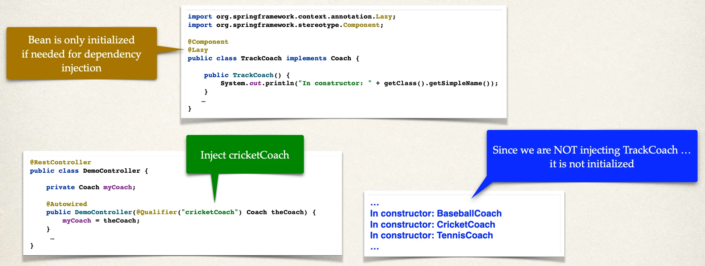
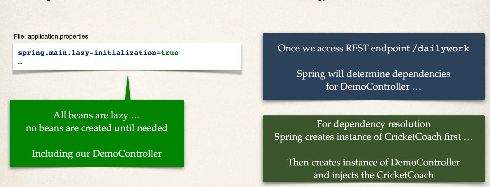
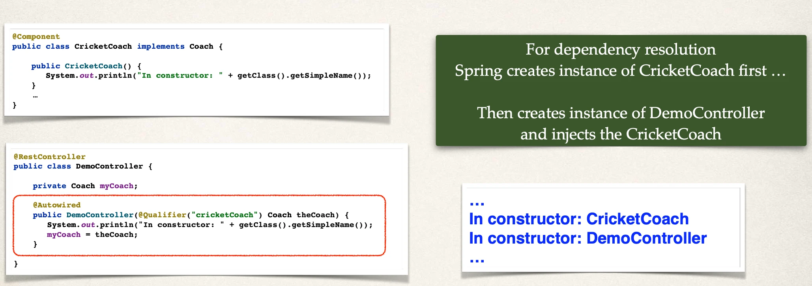

# Lazy Initialization - Overview

## Initialization

- By default, when your application starts, all beans are initialized
  - @Component, etc …
- Spring will create an instance of each and make them available

## Diagnostics: Add println to constructors



## When we start the application

- By default, when your application starts, all beans are initialized
- Spring will create an instance of each and make them available

```
…
In constructor: BaseballCoach
In constructor: CricketCoach
In constructor: TennisCoach
In constructor: TrackCoach
…
```

## Lazy Initialization

- Instead of creating all beans up front, we can specify lazy initialization
- A bean will only be initialized in the following cases:
  - It is needed for dependency injection
  - Or it is explicitly requested
- Add the @Lazy annotation to a given class

## Lazy Initialization with @Lazy



## Lazy Initialization

- To configure other beans for lazy initialization
  - We would need to add @Lazy to each class
- Turns into tedious work for a large number of classes
- I wish we could set a global configuration property …

## Lazy Initialization - Global configuration



## Add println to DemoController constructor



## Lazy Initialization

- Lazy initialization feature is disabled by default.
- You should profile your application before configuring lazy initialization.
- Avoid the common pitfall of premature optimization.

Advantages

- Only create objects as needed
- May help with faster startup time if you have large number of components

Disadvantages

- If you have web related components like @RestController, not created until requested
- May not discover configuration issues until too late
- Need to make sure you have enough memory for all beans once created
