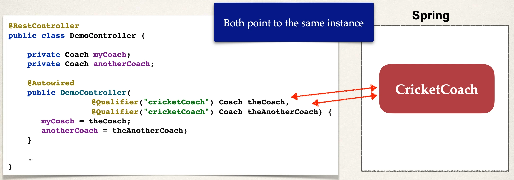
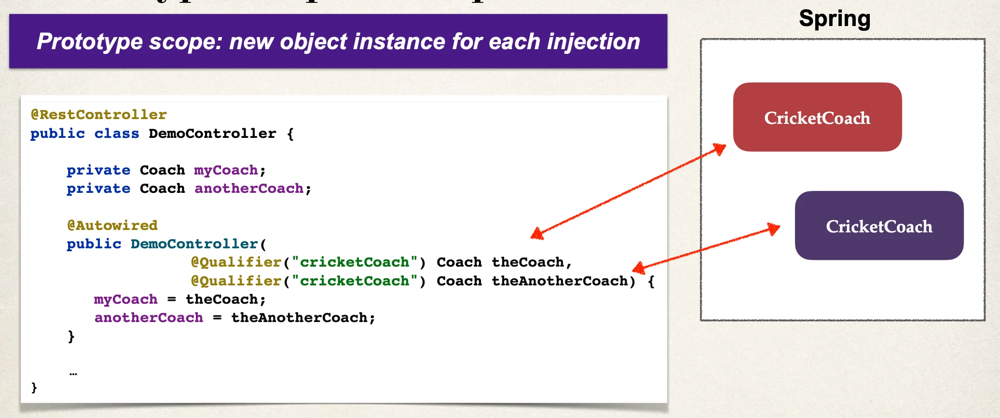

# Bean Scopes

Bean Scopes

- Scope refers to the lifecycle of a bean
- How long does the bean live?
- How many instances are created?
- How is the bean shared?

Default Scope

- Default scope is singleton

## Refresher: What Is a Singleton?

- Spring Container creates only one instance of the bean, by default
- It is cached in memory
- All dependency injections for the bean
  - will reference the SAME bean

## What is a Singleton



## Explicitly Specify Bean Scope

```java
import org.springframework.beans.factory.config.ConfigurableBeanFactory;
import org.springframework.context.annotation.Scope;
import org.springframework.stereotype.Component;


@Component
@Scope(ConfigurableBeanFactory.SCOPE_SINGLETON)
public class CricketCoach implements Coach {

    ...

}
```

## Additional Spring Bean Scopes

| Scope       | Description                                                 |
| ----------- | ----------------------------------------------------------- |
| singleton   | Create a single shared instance of the bean. Default scope. |
| prototype   | Creates a new bean instance for each container request.     |
| request     | Scoped to an HTTP web request. Only used for web apps.      |
| session     | Scoped to an HTTP web session. Only used for web apps.      |
| application | Scoped to a web app ServletContext. Only used for web apps. |
| websocket   | Scoped to a web socket. Only used for web apps.             |

### Prototype Scope



## Checking on the Scope

Check to see if this is the same bean

- True or False depending on the bean scope
  - Singleton: True
  - Prototype: False

```java
@RestController
public class DemoController {

    private Coach myCoach;
    private Coach anotherCoach;

    @Autowired
    public DemoController(
            @Qualifier("cricketCoach") Coach theCoach,
            @Qualifier("cricketCoach") Coach theAnotherCoach) {
        myCoach = theCoach;
        anotherCoach = theAnotherCoach;
    }

    @GetMapping("/check")
    public String check() {
        return "Comparing beans: myCoach == anotherCoach, " + (myCoach == anotherCoach);
    }

    ...
}
```
