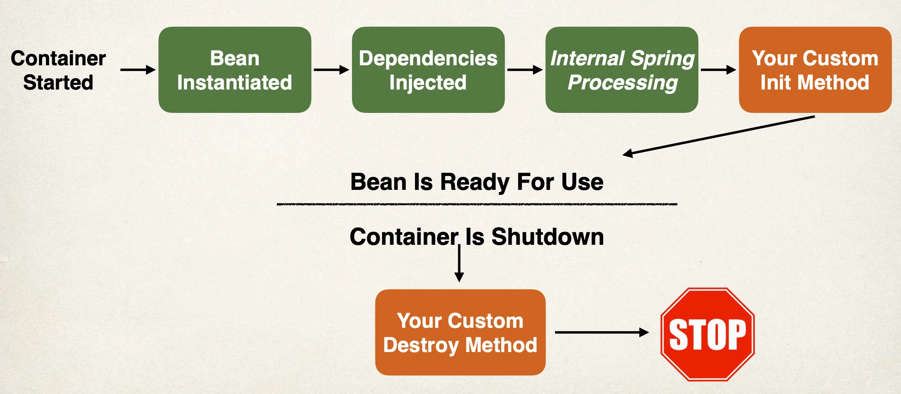

# Bean Lifecycle Methods - Overview

Bean Lifecycle Methods - Annotations

## Bean Lifecycle



## Bean Lifecycle Methods / Hooks

- You can add custom code during bean initialization
  - Calling custom business logic methods
  - Setting up handles to resources (db, sockets, file etc)
- You can add custom code during bean destruction
  - Calling custom business logic method
  - Clean up handles to resources (db, sockets, files etc)

## Init: method configuration

```java
@Component
public class CricketCoach implements Coach {

    public CricketCoach() {
        System.out.println("In constructor: " + getClass().getSimpleName());
    }

    @PostConstruct
    public void doMyStartupStuff() {
        System.out.println("In doMyStartupStuff(): " + getClass().getSimpleName());
    }

    ...
}
```

## Destroy: method configuration

```java
@Component
public class CricketCoach implements Coach {

    public CricketCoach() {
        System.out.println("In constructor: " + getClass().getSimpleName());
    }

    @PostConstruct
    public void doMyStartupStuff() {
        System.out.println("In doMyStartupStuff(): " + getClass().getSimpleName());
    }

    @PreDestroy
    public void doMyCleanupStuff() {
        System.out.println("In doMyCleanupStuff(): " + getClass().getSimpleName());
    }
}
```

## Development Process

1. Define your methods for init and destroy
2. Add annotations: @PostConstruct and @PreDestroy
