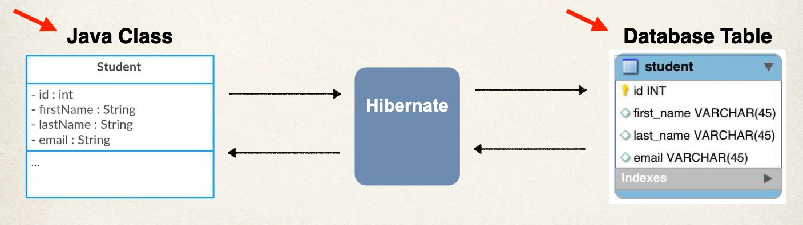
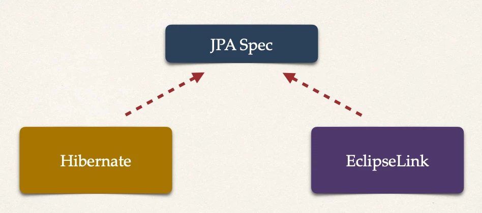

# Hibernate / JPA OVerview

Topics

- What is Hibernate?
- Benefits of Hibernate
- What is JPA?
- Benefits of JPA
- Code Snippets

## What is Hibernate?

- A framework for persisting / saving Java objects in a database
- www.hibernate.org/orm

## Benefits of Hibernate

- Hibernate handles all of the low-level SQL
- Minimizes the amount of JDBC code you have to develop
- Hibernate provides the Object-to-Relational Mapping (ORM)

## Object-To-Relational Mapping (ORM)

- The developer defines mapping between Java class and database table



## What is JPA?

https://www.jcp.org/en/jsr/detail?id=338:

- Jakarta Persistence API (JPA) … previously known as _Java Persistence API_
- Standard API for Object-to-Relational-Mapping (ORM)

Only a specification

- Defines a set of interfaces
- Requires an implementation to be usable

## JPA - Vendor Implementations

- https://en.wikipedia.org/wiki/Jakarta_Persistence



## What are Benefits of JPA

- By having a standard API, you are not locked to vendor's implementation
- Maintain portable, flexible code by coding to JPA spec (interfaces)
- Can theoretically switch vendor implementations
  - For example, if Vendor ABC stops supporting their product
  - You could switch to Vendor XYZ without vendor lock in

## Saving a Java Object with JPA

- `entityManager`: Special JPA helper object
- `persist(...)`: The data will be stored in the database SQL insert

```java
// create Java object
Student theStudent = new Student("Paul", "Doe", "paul@luv2code.com");
// save it to database
entityManager.persist(theStudent);
```

## Retrieving a Java Object with JPA

- `.find(...)`: Query the database for given id

```java
// create Java object
Student theStudent = new Student("Paul", "Doe", "paul@luv2code.com");
// save it to database
entityManager.persist(theStudent);
// now retrieve from database using the primary key
int theId = 1;
Student myStudent = entityManager.find(Student.class, theId);
```

## Querying for Java Objects

- `.getResultList`: Returns a list of Student objects from the database

```java
TypedQuery<Student> theQuery = entityManager.createQuery("from Student", Student.class);

List<Student> students= theQuery.getResultList();
```

## JPA/Hibernate CRUD Apps

- ***C***reate objects
- ***R***ead objects
- ***U***pdate objects
- ***D***elete objects
