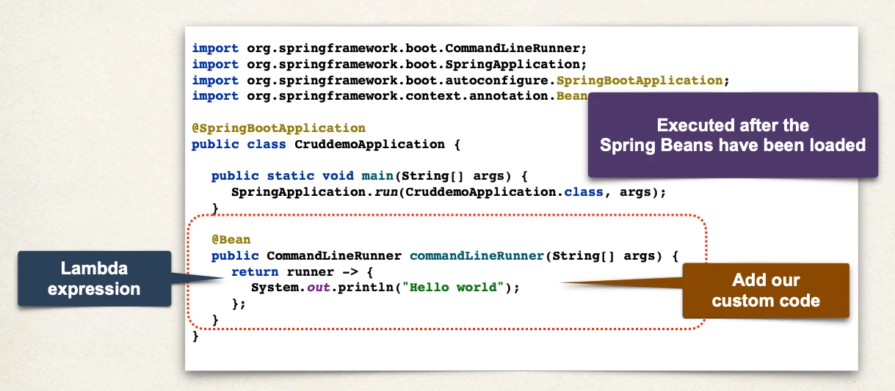

# Setting Up Spring Boot Project - Overview

## Automatic Data Source Configuration

- In Spring Boot, Hibernate is the default implementation of JPA
- `EntityManager` is main component for creating queries etc …
- `EntityManager` is from Jakarta Persistence API (JPA)

## Automatic Data Source Configuration

- Based on configs, Spring Boot will automatically create the beans:
- `DataSource`, `EntityManager`, …
- You can then inject these into your app, for example your DAO

## Setting up Project with Spring Initialzr

- At Spring Initializr website, start.spring.io
- Add dependencies
  - MySQL Driver: `mysql-connector-j`
  - Spring Data JPA: `spring-boot-starter-data-jpa`

## Spring Boot - Auto configuration

- Spring Boot will _automatically configure_ your data source for you
- Based on entries from Maven pom file
  - JDBC Driver: `mysql-connector-j`
  - Spring Data (ORM): `spring-boot-starter-data-jpa`
- DB connection info from `application.properties`

## `application.properties`

- No need to give JDBC driver class name
- Spring Boot will automatically detect it based on URL

```
spring.datasource.url=jdbc:mysql://localhost:3306/student_tracker
spring.datasource.username=springstudent
spring.datasource.password=springstudent
```

## Creating Spring Boot - Command Line App

- We will create a Spring Boot - Command Line App
- This will allow us to focus on Hibernate / JPA
- Later in the course, we will apply this to a CRUD REST API



- `CommandLineRunner` is Executed after the Spring Beans have been loaded
