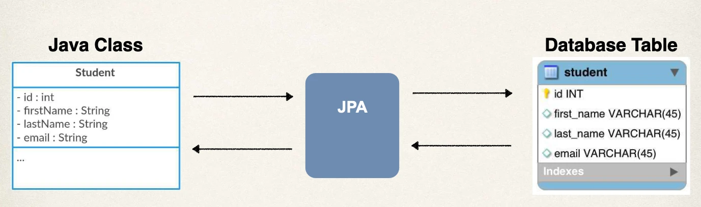
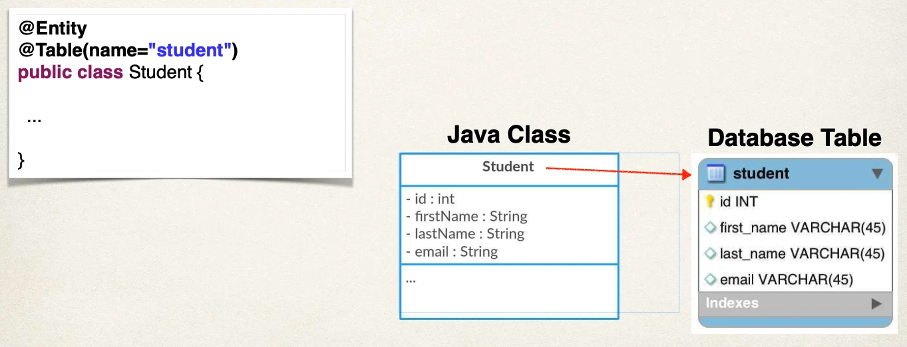
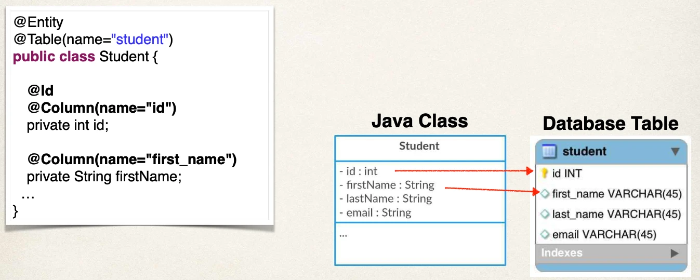

# JPA Annotations - Overview

JPA Development Process

## JPA Dev Process - To Do List

1. Annotate Java Class
2. Develop Java Code to perform database operations

## Let’s just say “JPA”

- As mentioned, Hibernate is the default JPA implementation in Spring Boot
- Going forward in this course, I will simply use the term: JPA
- Instead of saying “JPA Hibernate”
- We know that by default, Hibernate is used behind the scenes

## Terminology

- **Entity Class**: Java class that is mapped to a database table

## Object-to-Relational Mapping (ORM)



## Entity Class

At a minimum, the Entity class

- Must be annotated with @Entity
- Must have a public or protected no-argument constructor
- The class can have other constructors

## Constructors in Java - Refresher

Remember about constructors in Java

If you don’t declare any constructors,

- Java will provide a no-argument constructor for free

If you declare constructors with arguments,

- then you do NOT get a no-argument constructor for free
- In this case, you have to explicitly declare a no-argument constructor

## Java Annotations

- Step 1: Map class to database table
- Step 2: Map fields to database columns

### Step 1: Map class to database table



### Step 2: Map fields to database columns



## @Column - Optional

- Actually, the use of @Column is optional
- If not specified, the column name is the same name as Java field
- In general, I don’t recommend this approach
  - If you refactor the Java code, then it will not match existing database columns
  - This is a breaking change and you will need to update database column
- Same applies to @Table, database table name is same as the class

## Terminology

**Primary Key**: Uniquely identifies each row in a table

- Must be a unique value
- Cannot contain NULL values

### MySQL - Auto Increment

```sql
CREATE TABLE student (
  id int NOT NULL AUTO_INCREMENT,
  first_name varchar(45) DEFAULT NULL,
  last_name varchar(45) DEFAULT NULL,
  email varchar(45) DEFAULT NULL,
  PRIMARY KEY (id)
)
```

### JPA Identity - Primary Key

```java
@Entity
@Table(name="student")
public class Student {
  @Id
  @GeneratedValue(strategy=GenerationType.IDENTITY)
  @Column(name="id")
  private int id;
  …
}
```

### ID Generation Strategies

| Name                    | Description                                                                        |
| ----------------------- | ---------------------------------------------------------------------------------- |
| GenerationType.AUTO     | Pick an appropriate strategy for the particular database                           |
| GenerationType.IDENTITY | Assign primary keys using database identity column                                 |
| GenerationType.SEQUENCE | Assign primary keys using a database sequence                                      |
| GenerationType.TABLE    | Assign primary keys using an underlying database table to ensure uniqueness        |
| GenerationType.UUID     | Assign primary keys using a globally unique identifier (UUID) to ensure uniqueness |

## Bonus Bonus

- You can define your own CUSTOM generation strategy :-)
- Create implementation of `org.hibernate.id.IdentifierGenerator`
- Override the method: `public Serializable generate(…)`
