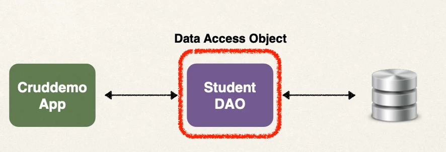
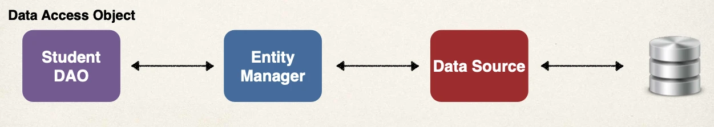

# Saving a Java Object with JPA - Overview - Part 1

## Sample App Features

- ***C***reate a new Student
- ***R***ead a Student
- ***U***pdate a Student
- ***D***elete a Student

## Student Data Access Object

- Responsible for interfacing with the database
- This is a common design pattern: Data Access Object (DAO)

| Methods             |
| ------------------- |
| save(...)           |
| findById(...)       |
| findAll()           |
| findByLastName(...) |
| update(...)         |
| delete(...)         |
| deleteAll()         |

### Cont.d

- Our DAO needs a JPA Entity Manager
- JPA Entity Manager is the main component for saving/retrieving entities

## JPA Entity Manager

- Our JPA Entity Manager needs a Data Source
- The Data Source defines database connection info
- JPA Entity Manager and Data Source are automatically created by Spring Boot
  - Based on the file: application.properties (JDBC URL, user id, password, etc …)
- We can autowire/inject the JPA Entity Manager into our Student DAO

## What about JpaRepository???

- Spring Data JPA has a JpaRepository interface
- This provides JPA database access with minimal coding

### Which One EntityManager or JpaRepository???

Answer

- Yes, we will use JpaRepository in this course
- We will cover it later in the course
- In this course, I want to show you various techniques for using JPA
- Knowing BOTH EntityManager and JpaRepository will help you on future projects
- Don’t worry … we’ll cover both :-)

### In Simple Terms

- If you need **low-level control and flexibility**, use `EntityManager`
- If you want **high-level of abstraction**, use `JpaRepository`

### Use Cases:

Entity Manager:

- Need low-level control over the database operations and want to write custom queries
- Provides low-level access to JPA and work directly with JPA entities
- Complex queries that required advanced features such as native SQL queries or stored procedure calls
- When you have custom requirements that are not easily handled by higher-level abstractions

JpaRepository:

- Provides commonly used CRUD operations out of the box, reducing the amount of code you need to write
- Additional features such as pagination, sorting
- Generate queries based on method names
- Can also create custom queries using `@Query`

### My Recommendation

- Choice depends on the application requirements and developer preference
- You can also use both in the same project
- For learning purposes, start with EntityManager then learn JpaRepository
- This will help you understand the low-level coding behind the scenes
- Knowing BOTH EntityManager and JpaRepository will help you on future projects
