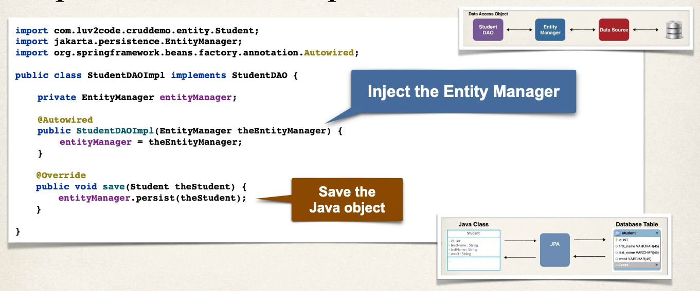
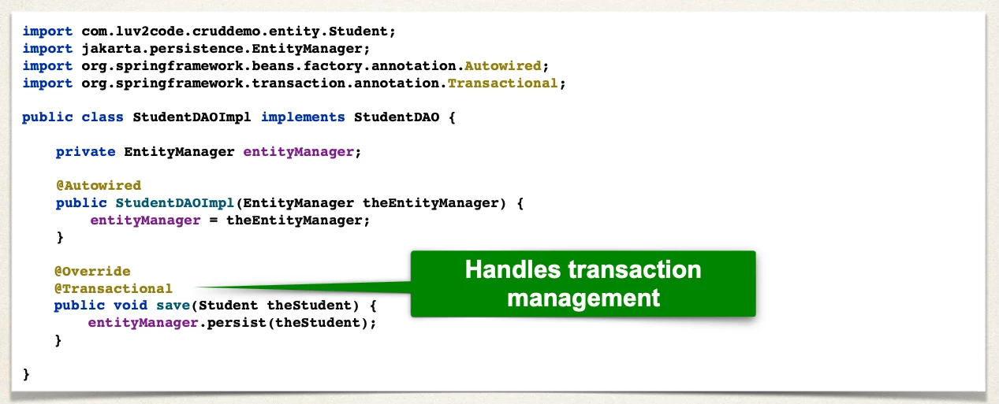
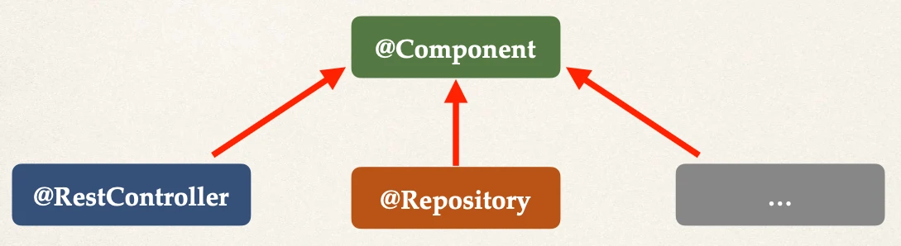

# Saving a Java Object with JPA - Overview - Part 1

## Student DAO

- Step 1: Define DAO interface
- Step 2: Define DAO implementation
  - Inject the entity manager
- Step 3: Update main app

### Step 1: Define DAO interface

```java
import com.luv2code.cruddemo.entity.Student;

public interface StudentDAO {
  void save(Student theStudent);
}
```

### Step 2: Define DAO implementation



## Spring `@Transactional`

- Spring provides an `@Transactional` annotation
- **Automagically** begin and end a transaction for your JPA code
  - No need for you to explicitly do this in your code
- This Spring **magic** happens behind the scenes

### Step 2: Define DAO implementation



## Specialized Annotation for DAOs

- Spring provides the `@Repository` annotation



- Applied to DAO implementations
- Spring will automatically register the DAO implementation
  - thanks to component-scanning
- Spring also provides translation of any JDBC related exceptions

### Step 2: Define DAO implementation

We add the `@Repository` annotation:

- Specialized annotation for repositories
- Supports component scanning
- Translates JDBC exceptions

```java
import com.luv2code.cruddemo.entity.Student;
import jakarta.persistence.EntityManager;
import org.springframework.beans.factory.annotation.Autowired;
import org.springframework.stereotype.Repository;
import org.springframework.transaction.annotation.Transactional;

@Repository
public class StudentDAOImpl implements StudentDAO {

    private EntityManager entityManager;

    @Autowired
    public StudentDAOImpl(EntityManager theEntityManager) {
        entityManager = theEntityManager;
    }

    @Override
    @Transactional
    public void save(Student theStudent) {
        entityManager.persist(theStudent);
    }
}
```

### Step 3: Update main app

Inject the StudentDAO:

- `public CommandLineRunner commandLineRunner(StudentDAO studentDAO) {...}`

```java
@SpringBootApplication
public class CruddemoApplication {

    public static void main(String[] args) {
        SpringApplication.run(CruddemoApplication.class, args);
    }

    @Bean
    public CommandLineRunner commandLineRunner(StudentDAO studentDAO) {
        return runner -> {
            createStudent(studentDAO);
        };
    }

    private void createStudent(StudentDAO studentDAO) {
        // create the student object
        System.out.println("Creating new student object...");
        Student tempStudent = new Student("Paul", "Doe", "paul@luv2code.com");

        // save the student object
        System.out.println("Saving the student...");
        studentDAO.save(tempStudent);

        // display id of the saved student
        System.out.println("Saved student. Generated id: " + tempStudent.getId());
    }
}
```
