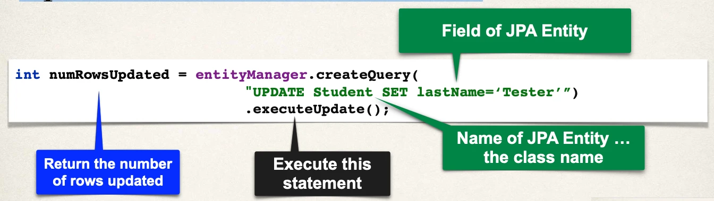

# Updating Objects with JPA - Overview

JPA CRUD Apps

- Create objects
- Read objects
- **Update objects**
- Delete objects

## Update a Student

```java
Student theStudent = entityManager.find(Student.class, 1);

// change first name to "Scooby"
theStudent.setFirstName("Scooby");

entityManager.merge(theStudent);
```

## Update last name for all students



## Development Process

1. Add new method to DAO interface
2. Add new method to DAO implementation
3. Update main app

## Step 1: Add new method to DAO interface

```java
import com.luv2code.cruddemo.entity.Student;

public interface StudentDAO {
  // …

  void update(Student theStudent);
}
```

## Step 2: Define DAO implementation

- Add `@Transactional` since we are performing an update

```java
import com.luv2code.cruddemo.entity.Student;
import jakarta.persistence.EntityManager;
import org.springframework.transaction.annotation.Transactional;
//…

private EntityManager entityManager;
  public class StudentDAOImpl implements StudentDAO {
    //…

    @Override
    @Transactional
    public void update(Student theStudent) {
      entityManager.merge(theStudent);
  }
}
```

## Step 3: Update main app

```java

// ...

@Bean
public CommandLineRunner commandLineRunner(StudentDAO studentDAO) {
  return runner -> {
    updateStudent(studentDAO);
  };
}

// ...

private void updateStudent(StudentDAO studentDAO) {
  // retrieve student based on the id: primary key
  int studentId = 1;
  System.out.println("Getting student with id: " + studentId);

  Student myStudent = studentDAO.findById(studentId);

  System.out.println("Updating student...");

  // change first name to "Scooby"
  myStudent.setFirstName("Scooby");
  studentDAO.update(myStudent);

  // display updated student
  System.out.println("Updated student: " + myStudent);
}
```
