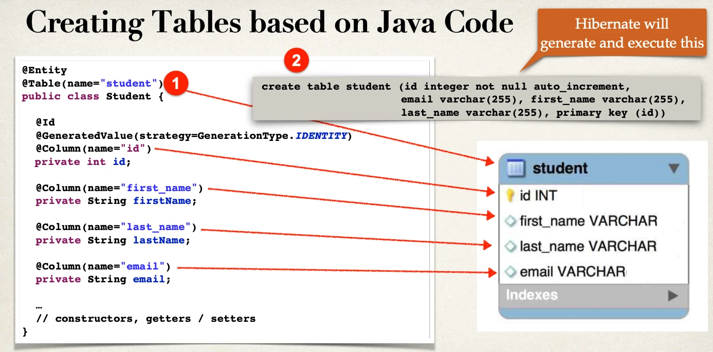

# Create Database Tables from Java Code - Overview

## Create database tables: `student`

- Previously, we created database tables by running a SQL script
- JPA/Hibernate provides an option to _automagically_ create database tables
- Creates tables based on Java code with JPA/Hibernate annotations
- Useful for development and testing

## Configuration

- In Spring Boot configuration file: `application.properties`

```
spring.jpa.hibernate.ddl-auto=create
```

- When you run your app, JPA/Hibernate will drop tables then create them
- Based on the JPA/Hibernate annotations in your Java code



### Configuration - `application.properties`

| Property Value | Property Description                                                                                                                                      |
| -------------- | --------------------------------------------------------------------------------------------------------------------------------------------------------- |
| none           | No action will be performed                                                                                                                               |
| create         | Database tables are dropped followed by database tables creation                                                                                          |
| create-drop    | Database tables are dropped followed by database tables creation. <br/> On application shutdown, drop the database tables. <br/> Useful for unit testing. |
| validate       | Validate the database tables schema                                                                                                                       |
| update         | Update the database tables schema                                                                                                                         |

## Basic Projects

Don't mind losing your data?

- For basic projects, can use auto configuration:
  - `spring.jpa.hibernate.ddl-auto=create`
- Database tables are dropped first and then created from scratch

> ⚠️ Note: ⚠️  
> When database tables are dropped, all data is lost

Want to keep the data?

- If you want to create tables once … and then keep data, use: update
  - `spring.jpa.hibernate.ddl-auto=update`
- However, will ALTER database schema based on latest code updates
- Be VERY careful here … only use for basic projects

### Warning

- Don't do this on Production databases!!!
  - `spring.jpa.hibernate.ddl-auto=create`
- You don't want to **drop** your Production data
  - **All data is deleted!!!**
- Instead for Production, you should have DBAs run SQL scripts

## Use Case

Automatic table generation (`spring.jpa.hibernate.ddl-auto=create`) is useful for

- Database integration testing with in-memory databases
- Basic, small hobby projects

## Recommendation

In general, I don’t recommend auto generation for enterprise, real-time projects:

- You can VERY easily drop PRODUCTION data if you are not careful

I recommend SQL scripts:

- Corporate DBAs prefer SQL scripts for governance and code review
- The SQL scripts can be customized and fine-tuned for complex database designs
- The SQL scripts can be version-controlled
- Can also work with schema migration tools such as Liquibase and Flyway
