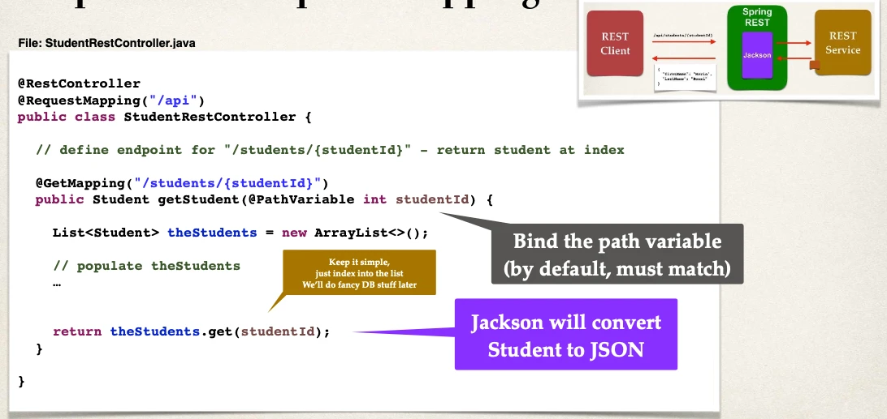

# Spring Boot Rest Path Variables - Overview

## Path Variables

Retrieve a single student by id

- `{studentId}`: Known as a _path variable_

```
GET /api/students/{studentId} Retrieve a single student
```

Sample Response:

```json
{
  "firstName": "John",
  "lastName": "Doe"
}
```

APIs

- `/api/students/0`
- `/api/students/1`
- `/api/students/2`

## Development Process

1. Add request mapping to Spring REST Service
   - Bind path variable to method parameter using `@PathVariable`

### Step 1: Add Request Mapping


