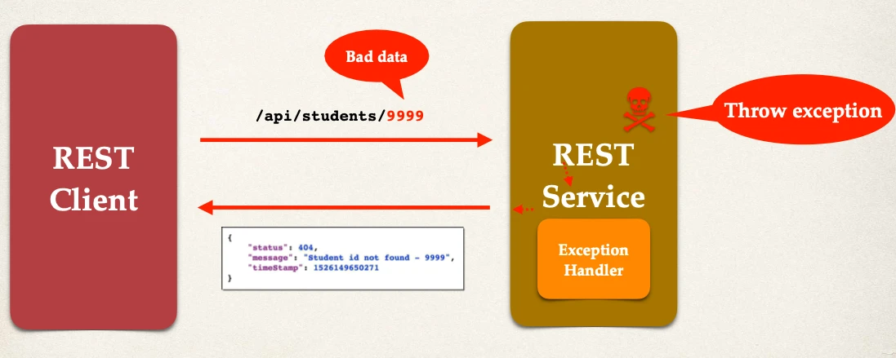

# Spring Boot REST Exception Handling - Overview - Part 1

What if we access an index that does not exist in our list? e.g. 9999?

```http
GET http://localhost:8080/api/students/9999
```

We get this response:

```json
{
  "timestamp": "2026-05-27T10:29:03.154Z",
  "status": 500,
  "error": "Internal Server Error",
  "path": "/api/students/9999"
}
```

## We really want this …

- Handle the exception and return error as JSON

```json
{
  "status": 404,
  "message": "Student id not found - 9999",
  "timeStamp": 1526149650271
}
```

## Spring REST Exception Handling



## Development Process

1. Create a custom error response class
2. Create a custom exception class
3. Update REST service to throw exception if student not found
4. Add an exception handler method using `@ExceptionHandler`

### Step 1: Create custom error response class

- The custom error response class will be sent back to client as JSON
- We will define as Java class (POJO)
- Jackson will handle converting it to JSON

You can define any custom fields that you want to track:

- In our case we'll use `status`, `message` and `timestamp`

```java
public class StudentErrorResponse {
  private int status;

  private String message;

  private long timeStamp;

  // constructors
  // getters / setters
}
```

- Which jackson will convert it to JSON as:

```json
{
  "status": 404,
  "message": "Student id not found - 9999",
  "timeStamp": 1526149650271
}
```

### Step 2: Create custom student exception

- The custom student exception will used by our REST service
- In our code, if we can't find student, then we'll throw an exception
- Need to define a custom student exception class
  - `StudentNotFoundException`

```java
public class StudentNotFoundException extends RuntimeException {
  public StudentNotFoundException(String message) {
    // Call super class constructor
    super(message);
  }
}
```
