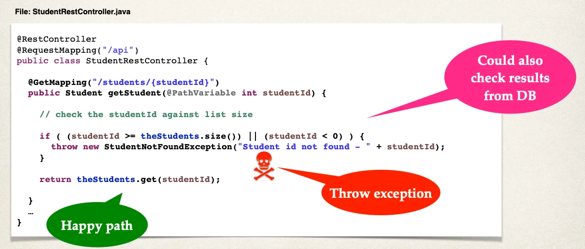
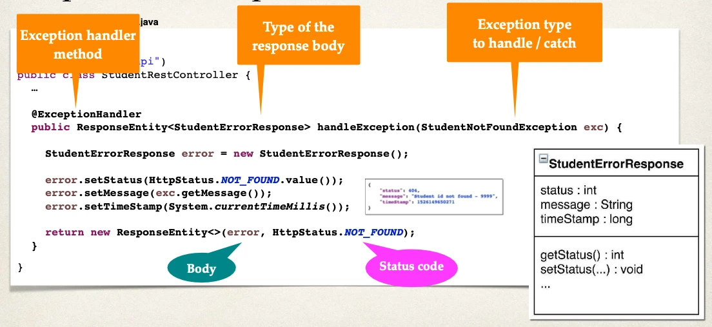

# Spring Boot REST Exception Handling - Overview - Part 2

### Step 3: Update REST service to throw exception

### Step 4: Add exception handler method

- Define exception handler method(s) with `@ExceptionHandler` annotation
- Exception handler will return a `ResponseEntity`
- `ResponseEntity` is a wrapper for the HTTP response object
- `ResponseEntity` provides fine-grained control to specify:
  - HTTP status code, HTTP headers and Response body

Update the file:

- `StudentRestController.java`
  
