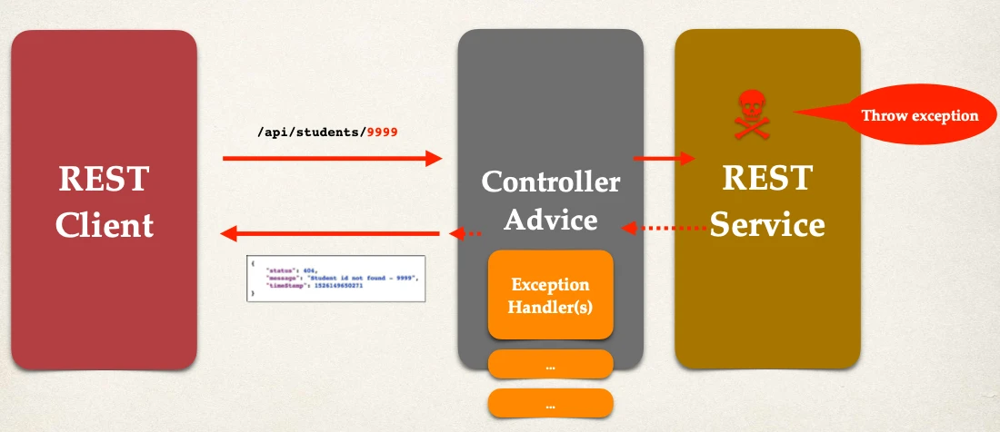
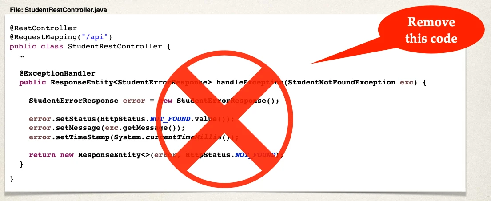

# Spring Boot REST Global Exception Handling - Overview

We've handled exceptions in our rest controller class

## It works, but …

Large projects will have multiple controllers

- Exception handler code is only for the specific REST controller
- Can't be reused by other controllers :-(
- We need global exception handlers
  - Promotes reuse
  - Centralizes exception handling

## Spring @ControllerAdvice

- `@ControllerAdvice` is similar to an interceptor / filter
- Can be used to:
  - Pre-process requests to controllers
  - Post-process responses to handle exceptions
- Perfect for global exception handling

This is Real-time use of AOP (Aspect Oriented Programming)

## Spring REST Exception Handling



## Development Process

1. Create new `@ControllerAdvice`
2. Refactor REST service … remove exception handling code
3. Add exception handling code to `@ControllerAdvice`

### Step 1: Create new @ControllerAdvice

File: `StudentRestExceptionHandler.java`:

```java
@ControllerAdvice
public class StudentRestExceptionHandler {
  // …
}
```

### Step 2: Refactor - remove exception handling



### Step 3: Add exception handler to @ControllerAdvice

File: `StudentRestExceptionHandler.java`:

```java
@ControllerAdvice
public class StudentRestExceptionHandler {

    @ExceptionHandler
    public ResponseEntity<StudentErrorResponse> handleException(StudentNotFoundException exc) {

        StudentErrorResponse error = new StudentErrorResponse();

        error.setStatus(HttpStatus.NOT_FOUND.value());
        error.setMessage(exc.getMessage());
        error.setTimeStamp(System.currentTimeMillis());

        return new ResponseEntity<>(error, HttpStatus.NOT_FOUND);
    }
}
```
