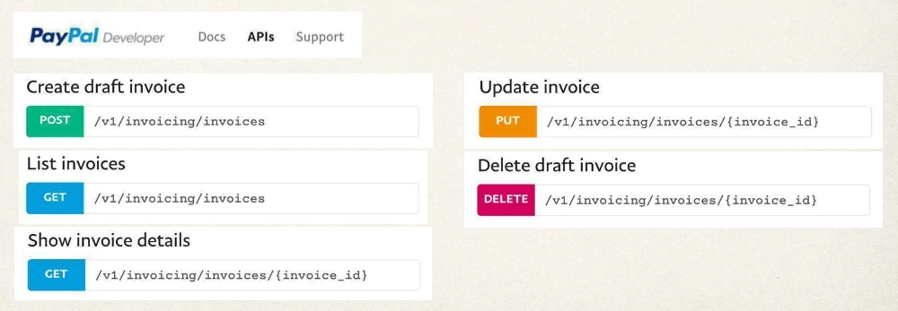
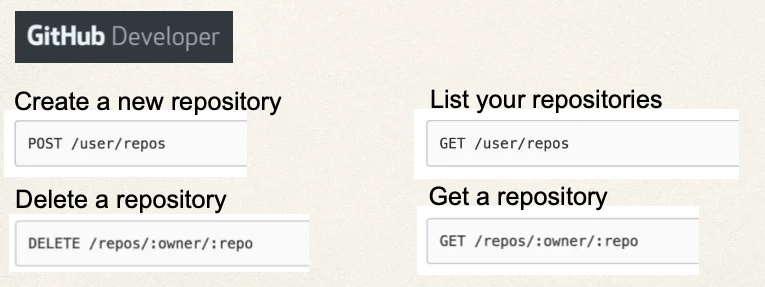

# Spring Boot REST API Design - API Design of Real-Time Projects

## More API Examples

On the following slides, we’ll look at APIs from other real-time projects

- PayPal
- GitHub
- SalesForce

### PayPal

- PayPal Invoicing API
- https://developer.paypal.com/docs/api/invoicing/



### GitHub

- GitHub Repositories API
- https://developer.github.com/v3/repos/#repositories



### SalesForce REST API

Industries REST API:

- https://sforce.co/2J40ALH

Retrieve All Individuals:

```
GET /services/apexrest/v1/individual/
```

Retrieve One Individual:

```
GET /services/apexrest/v1/individual/{individual_id}
```

Create an individual:

```
POST /services/apexrest/clinic01/v1/individual/
```

Update an individual:

```
PUT /services/apexrest/clinic01/v1/individual/
```
