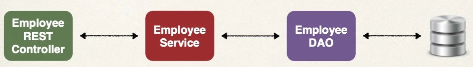

# Spring Boot REST Project Overview

We'll create a REST API with Spring Boot that connects to a database:

## API Requirements

Create a REST API for the Employee Directory. REST clients should be able to:

- Get a list of employees
- Get a single employee by id
- Add a new employee
- Update an employee
- Delete an employee

## Development Process

1. Set up Database Dev Environment
2. Create Spring Boot project using Spring Initializr
3. Get list of employees
4. Get single employee by ID
5. Add a new employee
6. Update an existing employee
7. Delete an existing employee

## Application Architecture

