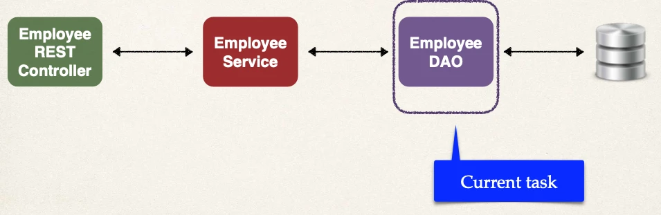

# Spring Boot REST DAO

## Application Architecture



## Development Process

1. Set up Database Dev Environment
2. Create Spring Boot project using Spring Initializr

Let's build a DAO Layer for the below, using standard JPA API:

3. Get list of employees
4. Get single employee by ID
5. Add a new employee
6. Update an existing employee
7. Delete an existing employee

## DAO Interface

```java
public interface EmployeeDAO {

  List<Employee> findAll();

}
```

## DAO Impl

```java
@Repository
public class EmployeeDAOJpaImpl implements EmployeeDAO {

    private EntityManager entityManager;

    @Autowired
    public EmployeeDAOJpaImpl(EntityManager theEntityManager) {
        entityManager = theEntityManager;
    }

    ...
}
```

## Get a list of employees

```java
@Override
public List<Employee> findAll() {

    // create a query
    TypedQuery<Employee> theQuery =
        entityManager.createQuery("from Employee", Employee.class);

    // execute query and get result list
    List<Employee> employees = theQuery.getResultList();

    // return the results
    return employees;
}
```

## Development Process

1. Update db configs in `application.properties`
2. Create Employee entity
3. Create DAO interface
4. Create DAO implementation
5. Create REST controller to use DAO
