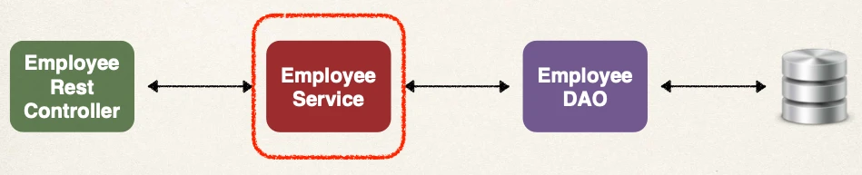
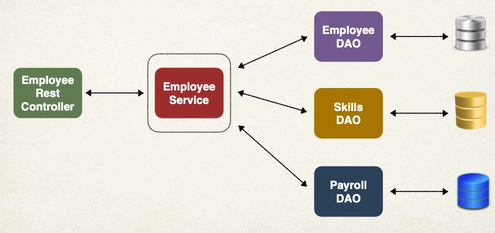
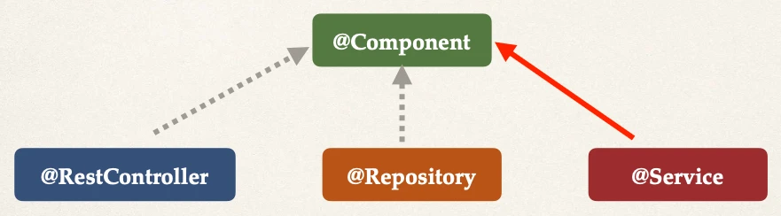

# Spring Boot Define Service Layer - Overview

## Refactor: Add a Service Layer



## Purpose of Service Layer

- Service Facade design pattern
- Intermediate layer for custom business logic
- Integrate data from multiple sources (DAO/repositories)

## Integrate Multiple Data Sources

- Provide controller with a single view of the data that we integrated from multiple backend datasources



## Specialized Annotation for Services

- Spring provides the `@Service` annotation



## Specialized Annotation for Services

- `@Service` applied to Service implementations
- Spring will automatically register the Service implementation
  - thanks to component-scanning

## Employee Service

1. Define Service interface
2. Define Service implementation
   - Inject the EmployeeDAO

### Step 1: Define Service interface

```java
public interface EmployeeService {
  List<Employee> findAll();
}
```

### Step 2: Define Service implementation

- `@Service` - enables component scanning

```java
@Service
public class EmployeeServiceImpl implements EmployeeService {

  // inject EmployeeDAO …

  @Override
  public List<Employee> findAll() {
    return employeeDAO.findAll();
  }
}
```
