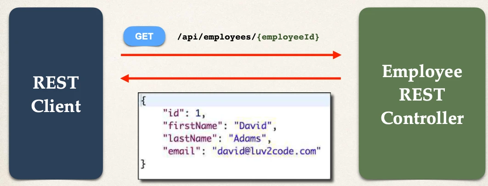
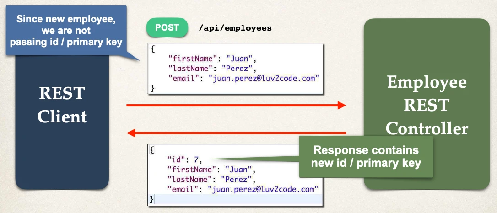

# Spring Boot REST: Get Single Employee - Coding

Hands On: `04-rest-crud-apis/code/20-spring-boot-rest-crud-employee`

## Development Process

Rest Controller Methods - Find and Add:

1. Set up Database Dev Environment
2. Create Spring Boot project using Spring Initializr

From Here 👇

3. Get list of employees
4. Get single employee by ID

To Here 👆

5. Add a new employee
6. Update an existing employee
7. Delete an existing employee

## Read a Single Employee

## Create a New Employee

## Sending JSON to Spring REST Controllers

When sending JSON data to Spring REST Controllers

- For controller to process JSON data, need to set a HTTP request header
  - `Content-type: application/json`
- Need to configure REST client to send the correct HTTP request header

Postman - Sending JSON in Request Body

- Must set HTTP request header in Postman
