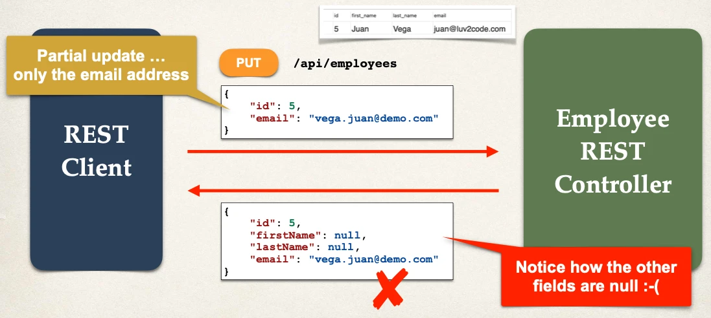
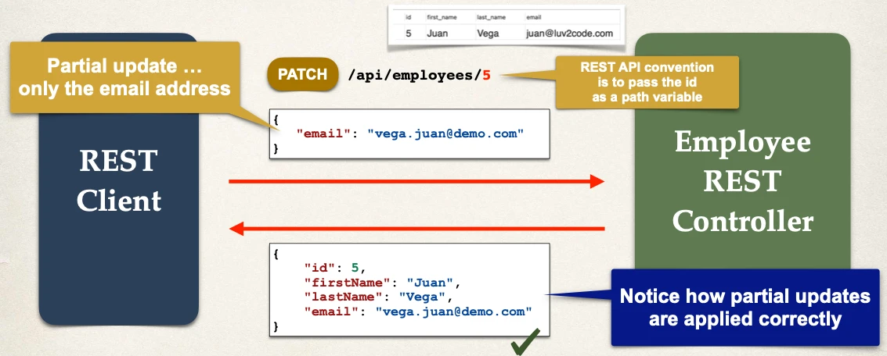
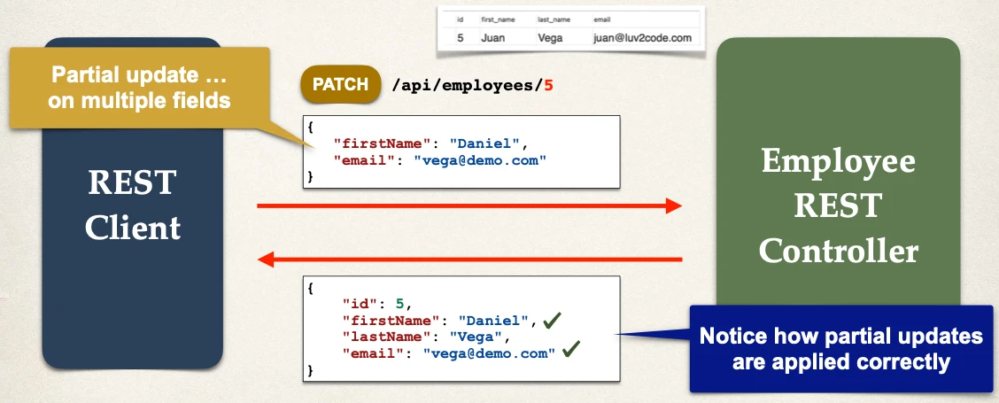

# Spring Boot REST: PATCH - Overview - Part 1

Rest Controller Methods Partial Updates - Patch:

## Partial Updates - Patch

- For partial updates, need to use HTTP PATCH

Comparison

- `PUT`: Replaces the entire resource
- `PATCH`: Modifies only specified parts of resource (partial)

Benefits of `PATCH`

- Efficiency: Reducing bandwidth by sending only partial changes
- Flexibility: Allows multiple partial updates in a single request

## PATCH - Partial Update Employee

## PATCH - Partial Update on multiple fields

