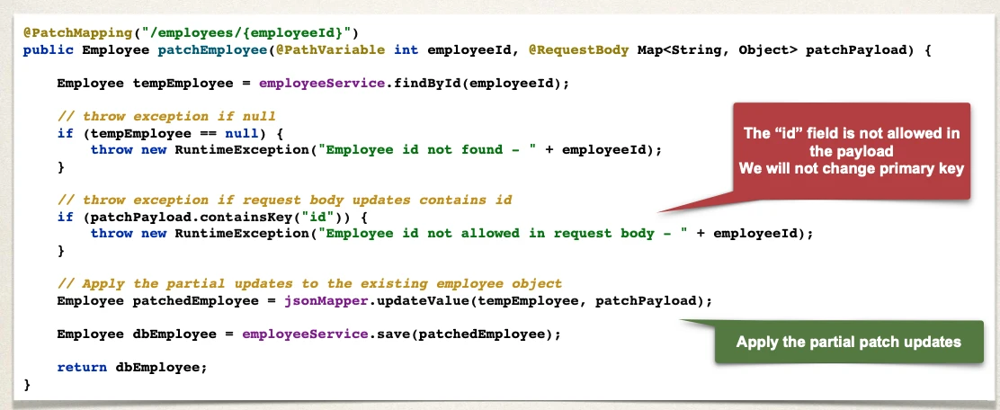

# Spring Boot REST: PATCH - Overview - Part 1

## PATCH - Development Process

1. Inject helper class: JsonMapper
2. Add support for `@PatchMapping` request method
3. Apply patch payload to employee

## Step 1: Inject helper class: JsonMapper

- JsonMapper is a helper class in the Jackson library for JSON processing
- JsonMapper provides following support
  - Converts Java objects to JSON and vice-versa
  - Allows merging of JSON nodes
  - Provides type safety for conversions: Java <-> JSON
- The JsonMapper is preconfigured by Spring Boot

### Cont.d

- `import tools.jackson.databind.json.JsonMapper;`: Helper class from Jackson library
- `JsonMapper theJsonMapper`: is auto-configured by Spring Boot for JSON processing

```java
import tools.jackson.databind.json.JsonMapper;
@RestController
@RequestMapping("/api")
public class EmployeeRestController {

  private JsonMapper jsonMapper;

  @Autowired
  public EmployeeRestController(EmployeeService theEmployeeService, JsonMapper theJsonMapper) {
    employeeService = theEmployeeService;
    jsonMapper = theJsonMapper;
  }
  // …
}
```

## Step 2: Add support for @PatchMapping request method



## PATCH

- The approach shown in the previous slides covers the majority of use cases for partial updates
- However, if you have complex use cases
  - Deeply nested JSON entities
  - Add, move, remove, copy fields
  - Move / manipulate array elements
  - Complex transformations / data enrichment
- RFC 6902 - JSON Patch - https://www.rfc-editor.org/rfc/rfc6902.html
- RFC 7386 - JSON Merge Patch - https://www.rfc-editor.org/rfc/rfc7386.html
- json-patch (implements the above) project - https://github.com/java-json-tools/json-patch
