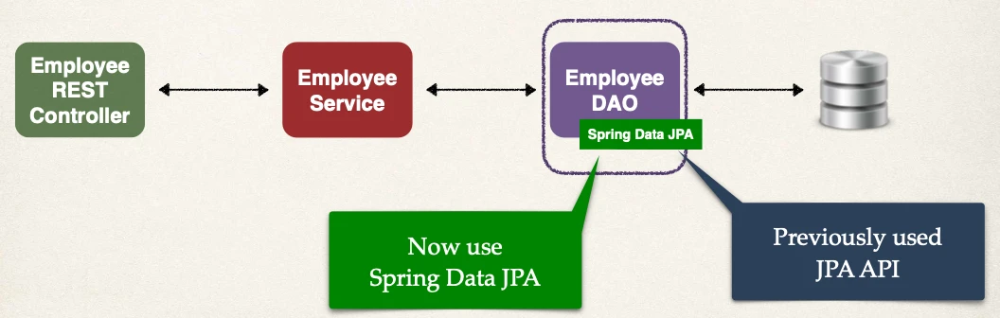
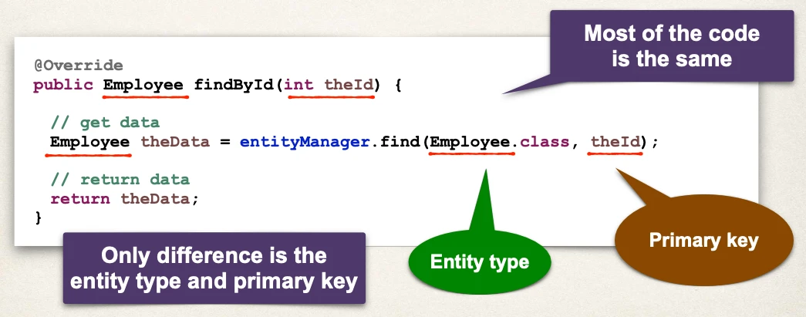
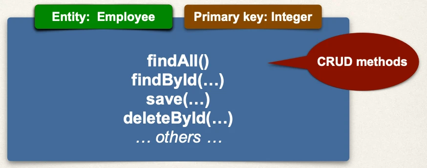
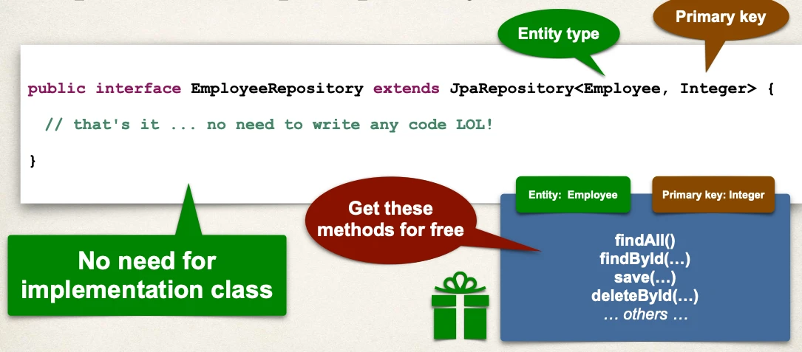
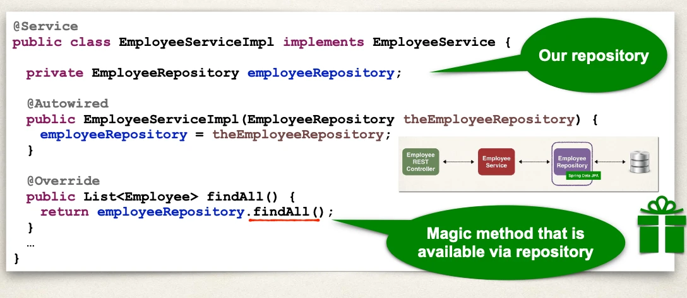
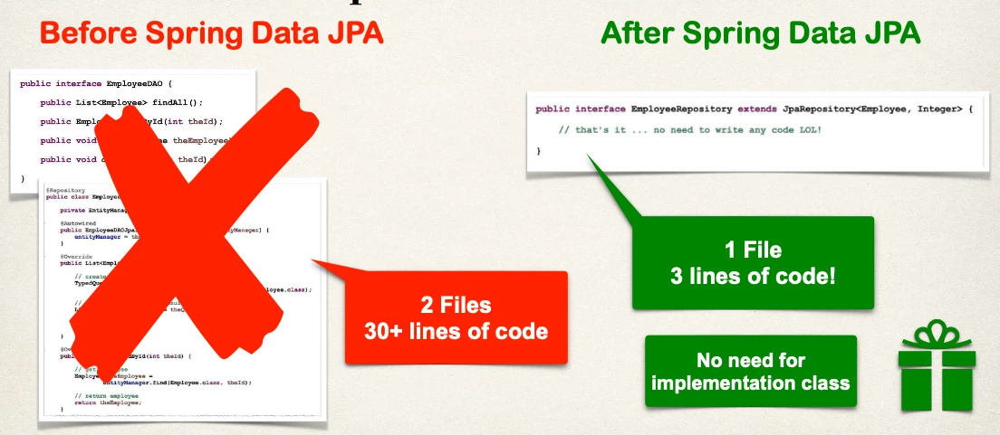

# Spring Boot REST: Spring Data JPA - Overview

## Application Architecture

## The Problem

- We saw how to create a DAO for Employee
- What if we need to create a DAO for another entity?
  - Customer, Student, Product, Book …
- Do we have to repeat all of the same code again???

## Creating DAO

- You may have noticed a pattern with creating DAOs

## My Wish

I wish we could tell Spring:

- Create a DAO for me
- Plug in my entity type and primary key
- Give me all of the basic CRUD features for free

## My Wish Diagram

## Spring Data JPA - Solution

- Spring Data JPA is the solution!!!!
  - https://spring.io/projects/spring-data-jpa
- Create a DAO and just plug in your entity type and primary key
- Spring will give you a CRUD implementation for FREE …. like MAGIC!!
- Helps to minimize boiler-plate DAO code … yaaay!!!
  - More than 70% reduction in code … depending on use case

## JpaRepository

- Spring Data JPA provides the interface: JpaRepository
- Exposes methods (some by inheritance from parents)

Plugin - Entity: Employee, Primary key: Integer:

- `findAll()`
- `findById(…)`
- `save(…)`
- `deleteById(…)`
- … others …

## Development Process

No need for implementation class:

1. Extend JpaRepository interface
2. Use your Repository in your app

### Step 1: Extend JpaRepository interface

### Step 2: Use Repository in your app

## JpaRepository Docs

Full list of methods available … see JavaDoc for JpaRepository:

- https://www.luv2code.com/jpa-repository-javadoc

## Minimized Boilerplate Code

## Advanced Features

Spring Data JPA has Advanced features available for:

- Extending and adding custom queries with JPQL
- Query Domain Specific Language (Query DSL)
- Defining custom methods (low-level coding)

- https://www.luv2code.com/spring-data-jpa-defining-custom-queries
