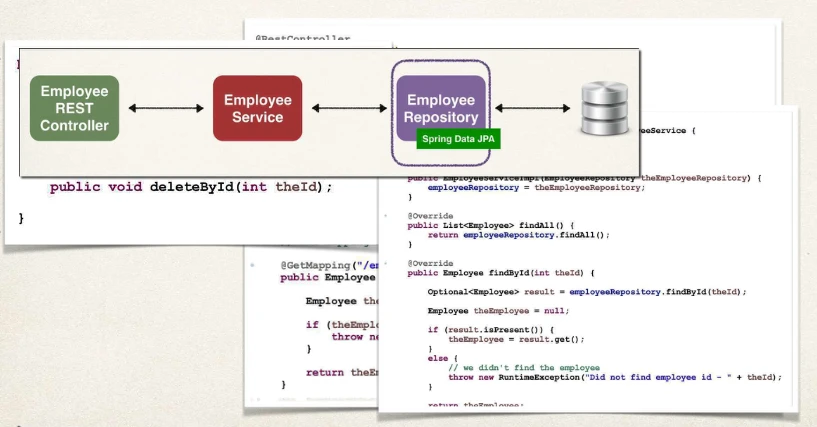
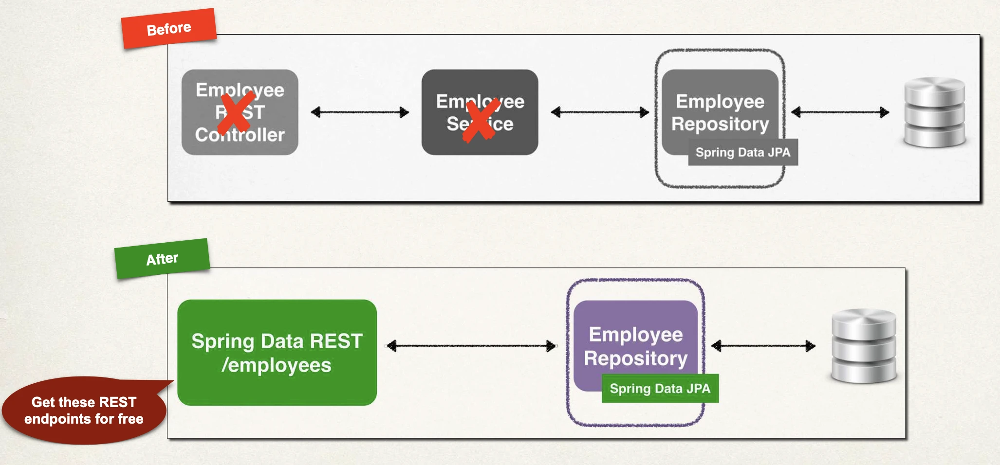
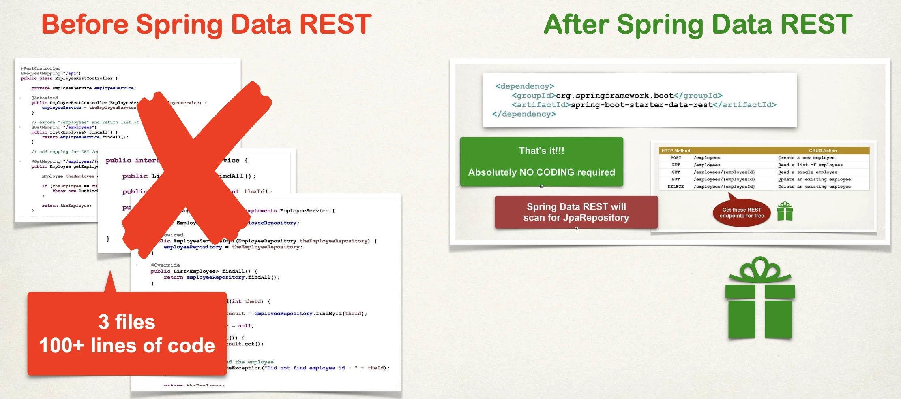
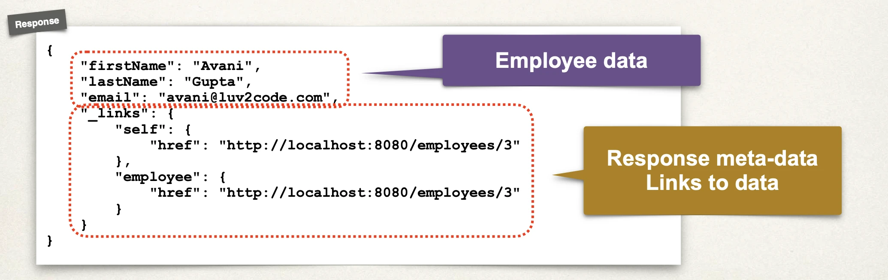
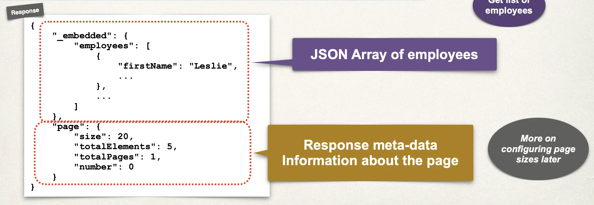

# Spring Boot REST - Spring Data REST - Overview

## Spring Data JPA

- Earlier, we saw the magic of Spring Data JPA
- This helped to eliminate boilerplate code

Hmmm … **Can this apply to REST APIs?**

## The Problem

- We saw how to create a REST API for Employee



## My Wish

I wish we could tell Spring:

- Create a REST API for me
- Use my existing JpaRepository (entity, primary key)
- Give me all of the basic REST API CRUD features for free

## Spring Data REST - Solution

Spring Data REST is the solution!!!!

- https://spring.io/projects/spring-data-rest
- Leverages your existing JpaRepository
- Spring will give you a REST CRUD implementation for FREE …. like
  MAGIC!!
  - Helps to minimize boiler-plate REST code!!!
  - No new coding required!!!

## REST API

- Spring Data REST will expose these endpoints for free!

| HTTP Method |                         | CRUD Action                 |
| ----------- | ----------------------- | --------------------------- |
| POST        | /employees              | Create a new employee       |
| GET         | /employees              | Read a list of employees    |
| GET         | /employees/{employeeId} | Read a single employee      |
| PUT         | /employees/{employeeId} | Update an existing employee |
| DELETE      | /employees/{employeeId} | Delete an existing employee |

## Spring Data REST - How Does It Work?

- Spring Data REST will scan your project for JpaRepository
- Expose REST APIs for each entity type for your JpaRepository

```java
public interface EmployeeRepository extends JpaRepository<Employee, Integer> {

}
```

## REST Endpoints

- By default, Spring Data REST will create endpoints based on entity type
- Simple pluralized form
  - First character of Entity type is lowercase
  - Then just adds an "s" to the entity

```java
public interface EmployeeRepository extends JpaRepository<Employee, Integer> {

}
```

- It will take `<Employee, ...>` and create an `employees` endpoint
- We'll see how to customize prularization

## Development Process

1. Add Spring Data REST to your Maven POM file

That's It!.

### Step 1: Add Spring Data REST to POM file

```xml
<dependency>
  <groupId>org.springframework.boot</groupId>
  <artifactId>spring-boot-starter-data-rest</artifactId>
</dependency>
```

- That's it!!! Absolutely NO CODING required
- Spring Data REST will scan for `JpaRepository`

## In A Nutshell

For Spring Data REST, you only need 3 items:

We already have these two:

1. Your entity: `Employee`
2. `JpaRepository`: `EmployeeRepository` extends `JpaRepository`

Only item that is new:

3. Maven POM dependency for: `spring-boot-starter-data-rest`

## Application Architecture



## Minimized Boilerplate Code



## HATEOAS

- Spring Data REST endpoints are HATEOAS compliant
  - HATEOAS: **H**ypermedia **a**s **t**he **E**ngine **o**f **A**pplication **S**tate
- Hypermedia-driven sites provide information to access REST interfaces
- Think of it as meta-data for REST data
  https://spring.io/projects/spring-hateoas

## HATEOAS ... cont.d

Get single employee

- Spring Data REST response using HATEOAS
- For example REST response from: `GET /employees/3`



For a collection, meta-data includes page size, total elements, pages etc:

- For example REST response from: `GET /employees`



For details on HATEOAS, see:

- https://spring.io/projects/spring-hateoas

HATEOAS uses Hypertext Application Language (HAL) data format

- For details on HAL, see
- https://en.wikipedia.org/wiki/Hypertext_Application_Language

## Advanced Features

Spring Data REST advanced features:

- Pagination, sorting and searching
- Extending and adding custom queries with JPQL
- Query Domain Specific Language (Query DSL)

- https://spring.io/projects/spring-data-rest
