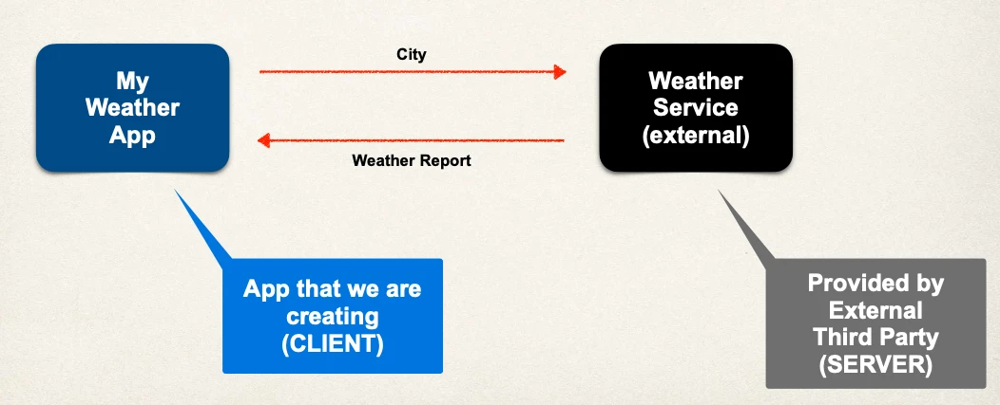

# What are Rest Services - Part 1

You will learn how to …

- Create REST APIs / Web Services with Spring
- Discuss REST concepts, JSON and HTTP messaging
- Install REST client tool: Postman
- Develop REST APIs / Web Services with `@RestController`
- Build a CRUD interface to the database with Spring REST

## Practical Results

- Introduction to Spring REST development
- Not an A to Z reference … for that you can see Spring Reference Manual

https://projects.spring.io/spring-framework/

## Business Problem

- Build a client app that provides the weather report for a city
- Need to get weather data from an external service

## Application Architecture



## Questions

- How will we connect to the Weather Service?
- What programming language do we use?
- What is the data format?

## Answers

How will we connect to the Weather Service?

- We can make REST API calls over HTTP
- REST: REpresentational State Transfer
- Lightweight approach for communicating between applications

What programming language do we use?

- REST is language independent
- The client application can use ANY programming language
- The server application can use ANY programming language

What is the data format?

- REST applications can use any data format
- Commonly see XML and JSON
- JSON is most popular and modern
  - JavaScript Object Notation

## Possible Solution

- Use online Weather Service API provided by: openweathermap.org
- Provide weather data via an API
- Data is available in multiple formats: JSON, XML etc …

## Call Weather Service

- The API documentation gives us the following:
- Pass in the latitude and longitude for your desired location

```http
api.openweathermap.org/data/<apiVersion>/onecall?lat={theLatitude}&lon={theLongitude}
```

## Response - Weather Report

- The Weather Service responds with JSON

```json
{
  "…": "",
  "temp": "xxx",
  "feels_like": "yyy",
  "humidity": "zzz",
  "…": ""
}
```

## Multiple Client Apps

Remember:

- REST calls can be made over HTTP
- REST is language independent

We can call the Weather Service from any programming language/framework

- Spring MVC
- C#
- iPhone App
