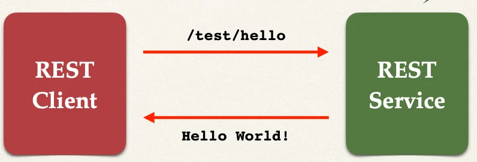

# Spring Boot REST Controller - Overview - Part 1

## Spring REST Hello World

- We'll build for the REST Service



## Spring REST Controller

- `@RestController`: Adds REST support
- `return "Hello World!"`: Returns content to client
- `@GetMapping("/hello")`: Access the REST endpoint at `/test/hello`

```java
@RestController
@RequestMapping("/test")
public class DemoRestController {

    @GetMapping("/hello")
    public String sayHello() {
        return "Hello World!";
    }
}
```

We could use the web-browser or postman to test this endpoint

## Web Browser vs Postman

For simple REST testing for GET requests

- Web Browser and Postman are similar

However, for advanced REST testing: POST, PUT etc …

- Postman has much better support
- POSTing JSON data, setting content type
- Passing HTTP request headers, authentication etc …
