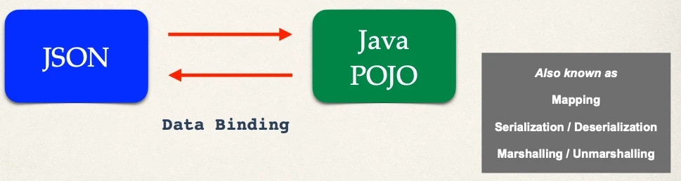
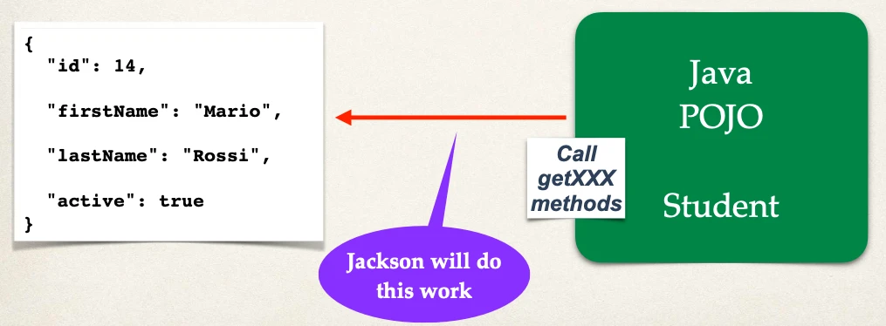

# JSON Jackson Data Binding

Java JSON Data Binding

- Data binding is the process of converting JSON data to a Java POJO

## JSON Data Binding with Jackson

- Spring uses the **Jackson Project** behind the scenes
- Jackson handles data binding between JSON and Java POJO
- Details on Jackson Project:
  - https://github.com/FasterXML/jackson-databind

## Jackson Data Binding

- By default, Jackson will call appropriate getter/setter method

### JSON to Java POJO

- Convert JSON to Java POJO … call setter methods on POJO
- Note: Jackson calls the setXXX methods
  - It does NOT access internal private fields directly

### Java POJO to JSON

Now, let’s go the other direction

- Convert Java POJO to JSON … call getter methods on POJO

## Spring and Jackson Support

Happens automatically behind the scenes

- When building Spring REST applications
- Spring will automatically handle Jackson Integration
- JSON data being passed to REST controller is converted to POJO
- Java object being returned from REST controller is converted to JSON
