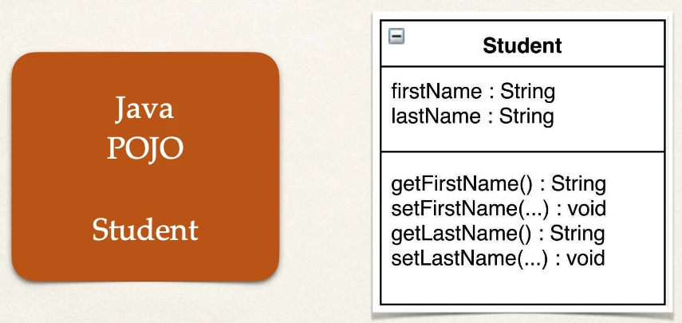
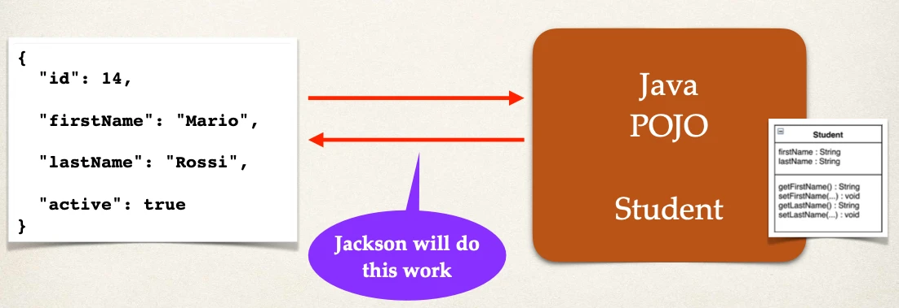
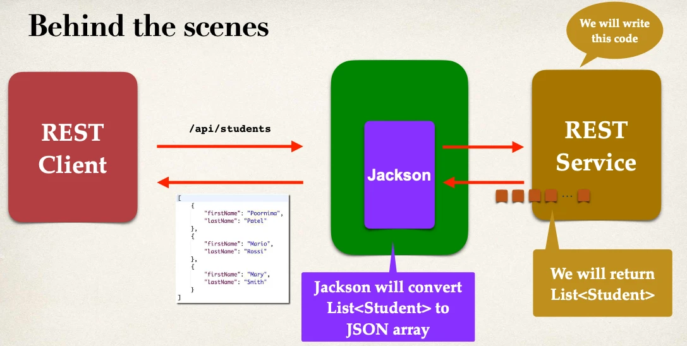

# Spring Boot REST POJO - Overview

## Create a New Service

- Return a list of students

```http
GET /api/students Returns a list of students
```

## Convert Java POJO to JSON

- Our REST Service will return `List<Student>`
- Need to convert `List<Student>` to JSON
- Jackson can help us out with this …

## Spring Boot and Jackson Support

Happens automatically behind the scenes

- Spring Boot will automatically handle Jackson integration
- JSON data being passed to REST controller is converted to Java POJO
- Java POJO being returned from REST controller is converted to JSON
- Spring Boot Starter Web automatically includes dependency for Jackson

## Student POJO (class)



## Jackson Data Binding

- Jackson will call appropriate getter/setter method



## Spring REST Service



## Development Process

1. Create Java POJO class for Student
2. Create Spring REST Service using @RestController

### Step 1: Create Java POJO class for Student

`Student.java`:

```java
public class Student {
    private String firstName;
    private String lastName;

    public Student() {
    }

    public Student(String firstName, String lastName) {
        this.firstName = firstName;
        this.lastName = lastName;
    }

    public String getFirstName() {
        return firstName;
    }

    public void setFirstName(String firstName) {
        this.firstName = firstName;
    }

    public String getLastName() {
        return lastName;
    }

    public void setLastName(String lastName) {
        this.lastName = lastName;
    }
}
```

### Step 2: Create @RestController

File: `StudentRestController.java`

```java
@RestController
@RequestMapping("/api")
public class StudentRestController {

    // define endpoint for "/students" - return list of students

    @GetMapping("/students")
    public List<Student> getStudents() {

        List<Student> theStudents = new ArrayList<>();

        theStudents.add(new Student("Poornima", "Patel"));
        theStudents.add(new Student("Mario", "Rossi"));
        theStudents.add(new Student("Mary", "Smith"));

        return theStudents;
    }
}
```
