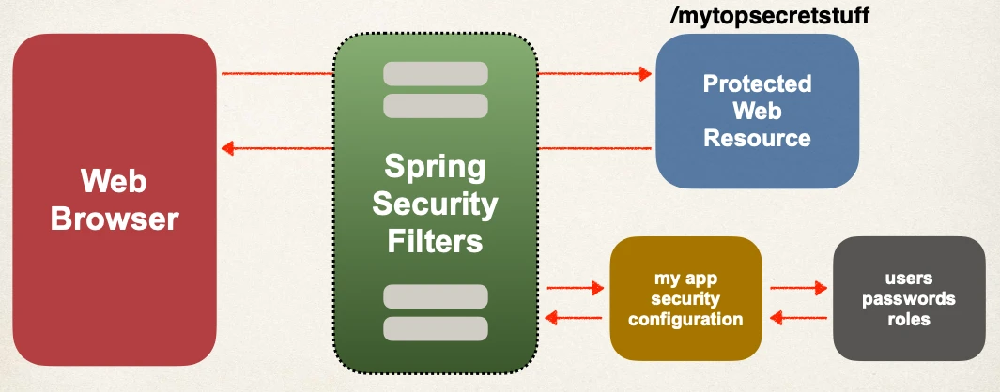
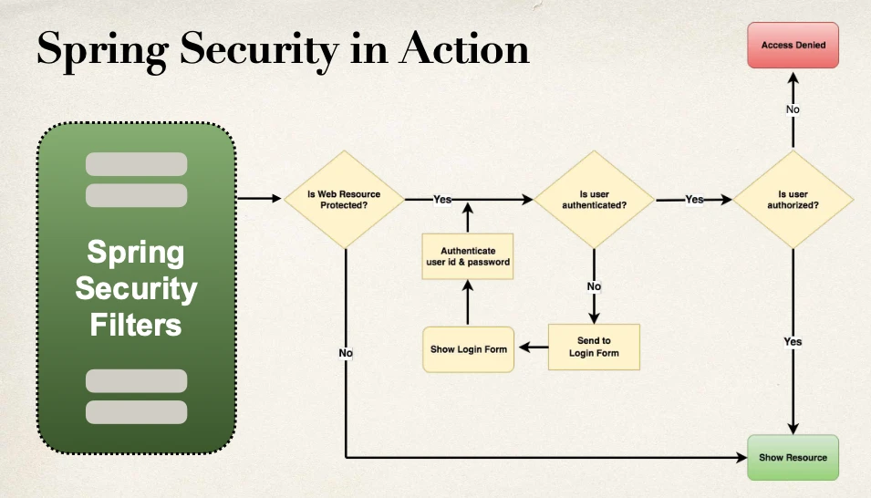
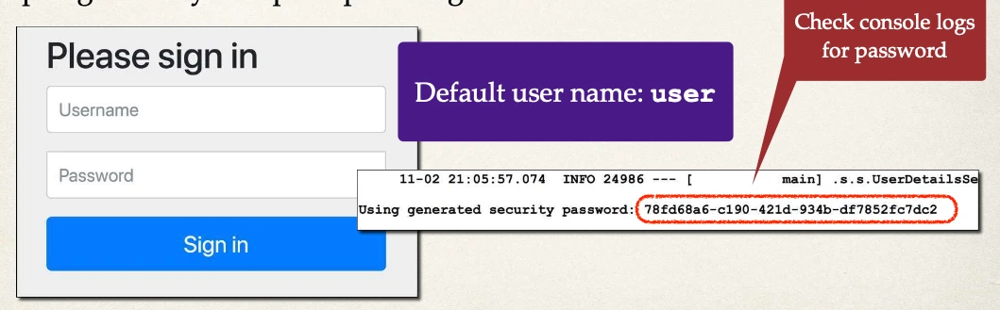

# Spring Boot REST API Security Overview

## You will learn how to...

- Secure Spring Boot REST APIs
- Define users and roles
- Protect URLs based on role
- Store users, passwords and roles in DB (plain-text -> encrypted)

## Practical Results

- Cover the most common Spring Security tasks that you will need on daily projects
- Not an A to Z reference … for that you can see Spring Security Reference Manual
  - http://www.luv2code.com/spring-security-reference-manual

## Spring Security Model

- Spring Security defines a framework for security
- Implemented using Servlet filters in the background
- Two methods of securing an app: declarative and programmatic

## Spring Security with Servlet Filters

- Servlet Filters are used to pre-process / post-process web requests
- Servlet Filters can route web requests based on security logic
- Spring provides a bulk of security functionality with servlet filters

## Spring Security Overview



Spring Security in Action



## Security Concepts

Authentication

- Check user id and password with credentials stored in app / db

Authorization

- Check to see if user has an authorized role

## Declarative Security

- Define application’s security constraints in configuration
  - All Java config: @Configuration
- Provides separation of concerns between application code and security

## Programmatic Security

- Spring Security provides an API for custom application coding
- Provides greater customization for specific app requirements

## Enabling Spring Security

1. Edit pom.xml and add spring-boot-starter-security

```xml
<dependency>
  <groupId>org.springframework.boot</groupId>
  <artifactId>spring-boot-starter-security</artifactId>
</dependency>
```

2. This will **automagically** secure all endpoints for application

## Secured Endpoints

- Now when you access your application
- Spring Security will prompt for login



## Spring Security configuration

- You can override default user name and generated password

File: `src/main/resources/application.properties`

```
spring.security.user.name=scott
spring.security.user.password=test123
```

## Authentication and Authorization

users, passwords, roles

- In-memory
- JDBC
- LDAP
- Custom / Pluggable
- others …

We will cover password storage in DB as plain-text AND encrypted
