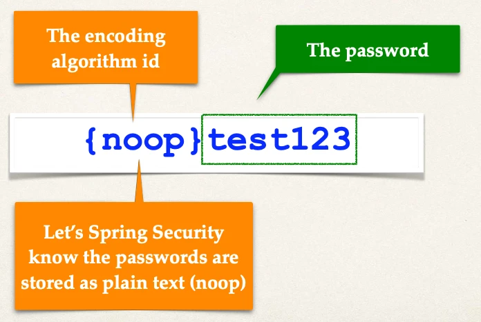

# Spring Boot REST API Security - Basic Configuration - Overview

## Our Users

- We can give ANY names for user roles

| User ID | Password | Roles                    |
| ------- | -------- | ------------------------ |
| john    | test123  | EMPLOYEE                 |
| mary    | test123  | EMPLOYEE, MANAGER        |
| susan   | test123  | EMPLOYEE, MANAGER, ADMIN |

## Development Process

1. Create Spring Security Configuration (@Configuration)
2. Add users, passwords and roles

## Step 1: Create Spring Security Configuration

File: `DemoSecurityConfig.java`:

```java
import org.springframework.context.annotation.Configuration;

@Configuration
public class DemoSecurityConfig {
  // add our security configurations here …
}
```

## Spring Security Password Storage

- In Spring Security, passwords are stored using a specific format

```
{id}encodedPassword
```

| ID     | Description             |
| ------ | ----------------------- |
| noop   | Plain text passwords    |
| bcrypt | BCrypt password hashing |
| ...    | ...                     |

### Password Example



## Step 2: Add users, passwords and roles

File: `DemoSecurityConfig.java`

```java
@Configuration
public class DemoSecurityConfig {

    @Bean
    public InMemoryUserDetailsManager userDetailsManager() {

        UserDetails john = User.builder()
            .username("john")
            .password("{noop}test123")
            .roles("EMPLOYEE")
            .build();

        UserDetails mary = User.builder()
            .username("mary")
            .password("{noop}test123")
            .roles("EMPLOYEE", "MANAGER")
            .build();

        UserDetails susan = User.builder()
            .username("susan")
            .password("{noop}test123")
            .roles("EMPLOYEE", "MANAGER", "ADMIN")
            .build();

        return new InMemoryUserDetailsManager(john, mary, susan);
    }
}
```

- We will add DB support in later videos (plaintext and encrypted)
