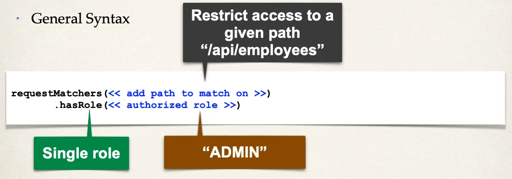
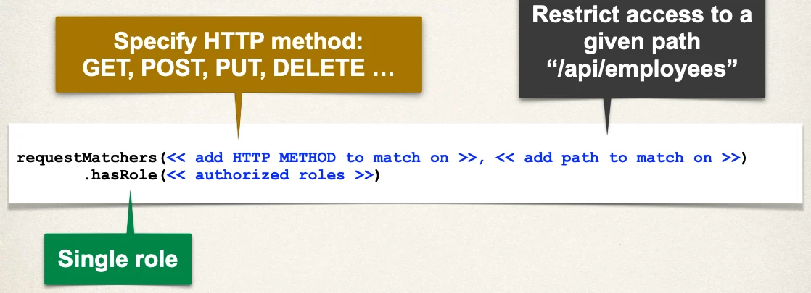
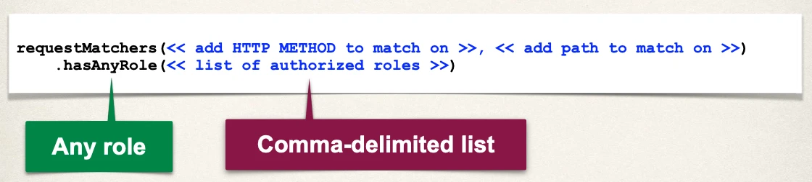

# Spring Boot REST API Security - Restrict URLs based on Roles - Overview

## Our Example

| HTTP Method | Endpoint                    | CRUD Action     | Role     |
| ----------- | --------------------------- | --------------- | -------- |
| GET         | /api/employees              | Read all        | EMPLOYEE |
| GET         | /api/employees/{employeeId} | Read single     | EMPLOYEE |
| POST        | /api/employees              | Create          | MANAGER  |
| PUT         | /api/employees              | Update          | MANAGER  |
| DELETE      | /api/employees/{employeeId} | Delete employee | ADMIN    |

## Restricting Access to Roles



### Cont.d (HTTP Method)



### Cont.d (Multiple Roles)



## Authorize Requests for EMPLOYEE role

- The `**` syntax: match on all sub-paths

```java
requestMatchers(HttpMethod.GET, "/api/employees").hasRole("EMPLOYEE")
requestMatchers(HttpMethod.GET, "/api/employees/**").hasRole("EMPLOYEE")
```

## Authorize Requests for MANAGER role

```java
requestMatchers(HttpMethod.POST, "/api/employees").hasRole("MANAGER")
requestMatchers(HttpMethod.PUT, "/api/employees").hasRole("MANAGER")
```

## Authorize Requests for ADMIN role

```java
requestMatchers(HttpMethod.DELETE, "/api/employees/**").hasRole("ADMIN")
```

## Pull It Together

```java
@Bean
public SecurityFilterChain filterChain(HttpSecurity http) throws Exception {

  http.authorizeHttpRequests(configurer ->
          configurer
              .requestMatchers(HttpMethod.GET, "/api/employees").hasRole("EMPLOYEE")
              .requestMatchers(HttpMethod.GET, "/api/employees/**").hasRole("EMPLOYEE")
              .requestMatchers(HttpMethod.POST, "/api/employees").hasRole("MANAGER")
              .requestMatchers(HttpMethod.PUT, "/api/employees").hasRole("MANAGER")
              .requestMatchers(HttpMethod.DELETE, "/api/employees/**").hasRole("ADMIN"));

  // use HTTP Basic authentication
  http.httpBasic(Customizer.withDefaults());

  return http.build();
}
```

## Cross-Site Request Forgery (CSRF)

- Spring Security can protect against CSRF attacks
- Embed additional authentication data/token into all HTML forms
- On subsequent requests, web app will verify token before processing
- Primary use case is traditional web applications (HTML forms etc …)

### When to use CSRF Protection?

The Spring Security team recommends:

- Use CSRF protection for any normal browser web requests
- Traditional web apps with HTML forms to add/modify data

If you are building a REST API for non-browser clients

- you _may_ want to disable CSRF protection

In general, not required for stateless REST APIs

- That use POST, PUT, DELETE and/or PATCH

## Pull It Together

```java
@Bean
public SecurityFilterChain filterChain(HttpSecurity http) throws Exception {

  http.authorizeHttpRequests(configurer ->
          configurer
              .requestMatchers(HttpMethod.GET, "/api/employees").hasRole("EMPLOYEE")
              .requestMatchers(HttpMethod.GET, "/api/employees/**").hasRole("EMPLOYEE")
              .requestMatchers(HttpMethod.POST, "/api/employees").hasRole("MANAGER")
              .requestMatchers(HttpMethod.PUT, "/api/employees").hasRole("MANAGER")
              .requestMatchers(HttpMethod.DELETE, "/api/employees/**").hasRole("ADMIN"));

  // use HTTP Basic authentication
  http.httpBasic(Customizer.withDefaults());

  // disable Cross Site Request Forgery (CSRF)
  http.csrf(csrf -> csrf.disable());

  return http.build();
}
```
