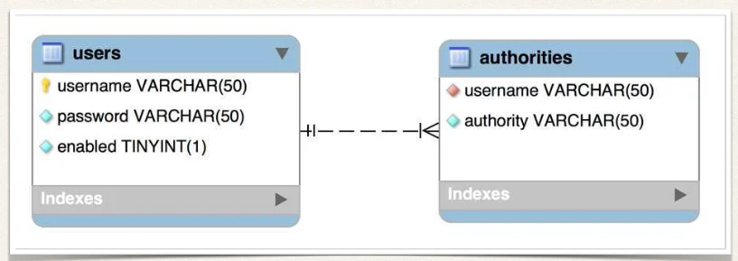
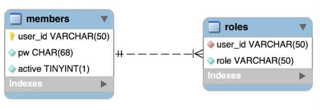

# Spring Boot REST API Security - JDBC Authentication - Custom Tables - Overview

## Default Spring Security Database Schema



## Custom Tables

- What if we have our own custom tables?
- Our own custom column names?



This is all custom Nothing matches with default Spring Security table schema

## For Security Schema Customization

- Tell Spring how to query your custom tables
- Provide query to find user by user name
- Provide query to find authorities / roles by user name

## Development Process

1. Create our custom tables with SQL
2. Update Spring Security Configuration
   - Provide query to find user by user name
   - Provide query to find authorities / roles by user name

### Step 1: Create our custom tables with SQL


### Step 2: Update Spring Security Configuration

- Question mark `?` Parameter value will be the user name from login

```java
@Configuration
public class DemoSecurityConfig {

    @Bean
    public UserDetailsManager userDetailsManager(DataSource dataSource) {
        JdbcUserDetailsManager theUserDetailsManager = new JdbcUserDetailsManager(dataSource);

        // How to find users
        theUserDetailsManager
            .setUsersByUsernameQuery("select user_id, pw, active from members where user_id=?");

        // How to find roles
        theUserDetailsManager
            .setAuthoritiesByUsernameQuery("select user_id, role from roles where user_id=?");

        return theUserDetailsManager;
    }

    // ...

}
```
