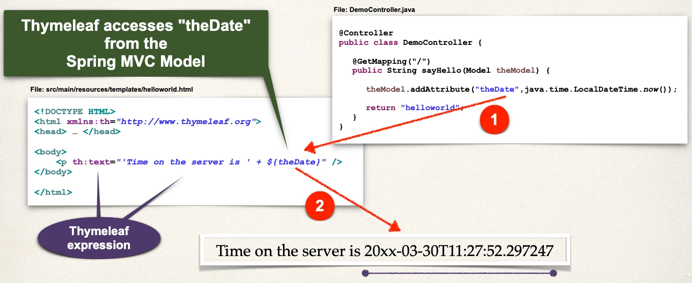

# Spring Boot - Spring MVC with Thymeleaf - Overview

## What is Thymeleaf?

`www.thymeleaf.org`: Separate project Unrelated to spring.io

- Thymeleaf is a Java templating engine
- Commonly used to generate the HTML views for web apps
- However, it is a general purpose templating engine
- Can use Thymeleaf outside of web apps (more on this later)

## What is a Thymeleaf template?

- Can be an HTML page with some Thymeleaf expressions
- HTML can include dynamic content from Thymeleaf expressions
- The Thymeleaf expressions Can access Java code, objects Spring beans

## Where is the Thymeleaf template processed?

- In a web app, Thymeleaf is processed on the server
- Results included in HTML returned to browser


## Development Process

1. Add Thymeleaf to Maven POM file
2. Develop Spring MVC Controller
3. Create Thymeleaf template

### Step 1: Add Thymeleaf to Maven pom file

Based on this, Spring Boot will auto configure to use Thymeleaf templates

```xml
<dependency>
  <groupId>org.springframework.boot</groupId>
  <artifactId>spring-boot-starter-thymeleaf</artifactId>
</dependency>
```

### Step 2: Develop Spring MVC Controller

File: `DemoController.java`

- `return "helloworld";`: `src/main/resources/templates/helloworld.html`

```java
@Controller
public class DemoController {

  @GetMapping("/")
  public String sayHello(Model theModel) {

    theModel.addAttribute("theDate", java.time.LocalDateTime.now());

    return "helloworld";
  }
}
```

## Where to place Thymeleaf template?

- In Spring Boot, your Thymeleaf template files go in
  - `src/main/resources/templates`
- For web apps, Thymeleaf templates have a `.html` extension

### Step 3: Create Thymeleaf template

`<html xmlns:th="http://www.thymeleaf.org">`: To use Thymeleaf expressions


## Additional Features

- Looping and conditionals
- CSS and JavaScript integration
- Template layouts and fragments
