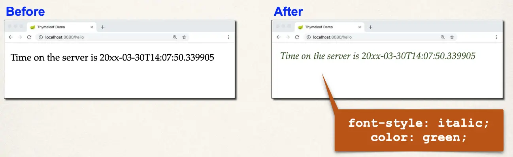
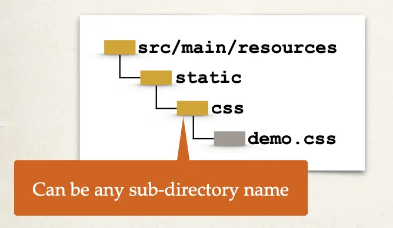
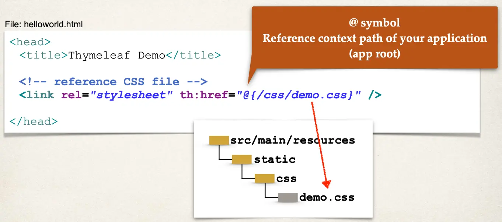
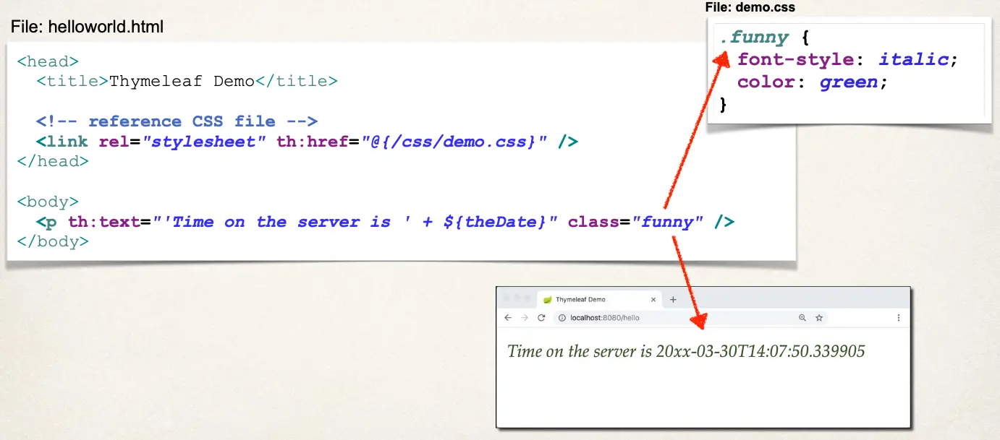
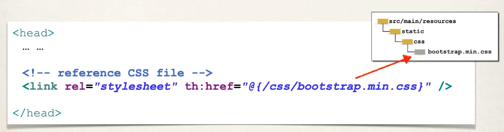

# Spring Boot - Spring MVC with Thymeleaf and CSS - Overview

## Let's Apply CSS Styles to our Page



## Using CSS with Thymleaf Templates

- You have the option of using
  - Local CSS files as part of your project
  - Referencing remote CSS files
- We'll cover both options in this video

## Development Process

1. Create CSS file
2. Reference CSS in Thymeleaf template
3. Apply CSS style

### Step 1: Create CSS file

Spring Boot will look for static resources in the directory:

- `src/main/resources/static`

> Note:
> You can create your own custom sub-directories
>
> - `static/css`
> - `static/images`
> - `static/js`



`demo.css`:

```css
.funny {
  font-style: italic;
  color: green;
}
```

### Step 2: Reference CSS in Thymeleaf template



### Step 3: Apply CSS



## Other search directories

Spring Boot will search following directories for static resources:

- `/src/main/resources`

Search order: `top-down`:

1. `META-INF/resources`
2. `/resources`
3. `/static`
4. `/public`

## 3rd Party CSS Libraries - Bootstrap

Local Installation

- Download Bootstrap file(s) and add to /static/css directory



- Remote Files

```html
<head>
  <!-- reference CSS file -->
  <link
    rel="stylesheet"
    href="https://cdn.jsdelivr.net/npm/bootstrap@5.2.3/dist/css/bootstrap.min.css"
  />
</head>
```
