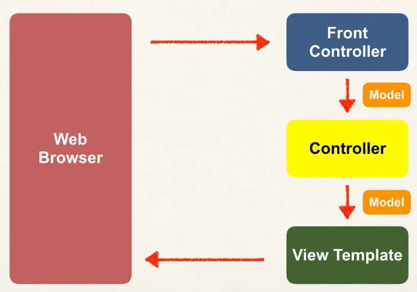

# Spring Boot - Spring MVC Behind the Scenes

## Components of a Spring MVC Application

- A set of web pages to layout UI components
- A collection of Spring beans (controllers, services, etc…)
- Spring configuration (XML, Annotations or Java)

## How Spring MVC Works Behind the Scenes

## Spring MVC Front Controller

Front controller known as `DispatcherServlet`

- Part of the Spring Framework
- Already developed by Spring Dev Team

You will create

- **M**odel objects (orange)
- **V**iew templates (dark green)
- **C**ontroller classes (yellow)

### **C**ontroller

- Code created by developer
- Contains your business logic
  - Handle the request
  - Store/retrieve data (db, web service…)
  - Place data in model
- Send to appropriate view template

### **M**odel

- Model: contains your data
- Store/retrieve data via backend systems
  - database, web service, etc…
  - Use a Spring bean if you like
- Place your data in the model
  - Data can be any Java object/collection

### **V**iew Template

- Spring MVC is flexible
  - Supports many view templates
- Recommended: Thymeleaf
- Developer creates a page
  - Displays data

Other view templates supported

- Groovy, Velocity, Freemarker, etc…
- For details, see: https://www.luv2code.com/spring-mvc-views
