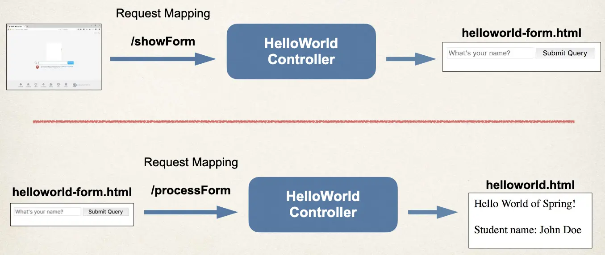

# Spring Boot - Hello World Form and Model - Overview

## High Level View


## Application Flow



## Controller Class

```java
@Controller
public class HelloWorldController {

    // need a controller method to show the initial HTML form

    @RequestMapping("/showForm")
    public String showForm() {
        return "helloworld-form";
    }

    // need a controller method to process the HTML form

    @RequestMapping("/processForm")
    public String processForm() {
        return "helloworld";
    }
}
```

## Development Process

1. Create Controller class
2. Show HTML form  
   a. Create controller method to show HTML Form  
   b. Create View Page for HTML form
3. Process HTML Form  
   a. Create controller method to process HTML Form  
   b. Develop View Page for Confirmation
