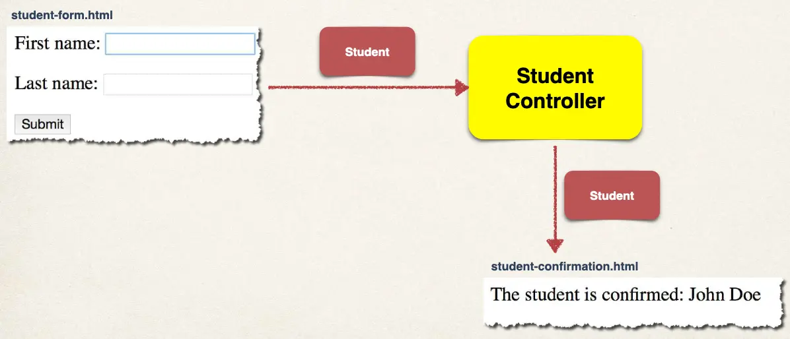

# Spring Boot - Spring MVC Form Data Binding - Text Fields - Overview

## Review HTML Forms

- HTML Forms are used to get input from the user

## Data Binding

- Spring MVC forms can make use of data binding
- Automatically setting / retrieving data from a Java object / bean

## Big Picture



## Showing Form

In your Spring Controller

- Before you show the form, you must add a model attribute
- This is a bean that will hold form data for the data binding

## Show Form - Add Model Attribute

```java
@GetMapping("/showStudentForm")
public String showForm(Model theModel) {
    theModel.addAttribute("student", new Student());
    return "student-form";
}
```

## Setting up HTML Form - Data Binding

```html
<form th:action="@{/processStudentForm}" th:object="${student}" method="POST">
  First name: <input type="text" th:field="*{firstName}" />

  <br /><br />

  Last name: <input type="text" th:field="*{lastName}" />

  <br /><br />

  <input type="submit" value="Submit" />
</form>
```

- `th:object="${student}"`: Name of model attribute
- `th:field="*{firstName}"`: `*{ … }` is shortcut syntax for: `${student.firstName}` or `${student.lastName}`

When form is loaded, Spring MVC will read student from the model, then call:

- `student.getFirstName()`
- `student.getLastName()`

When form is submitted, Spring MVC will create a new Student instance and add to the model, then call:

- `student.setFirstName()`
- `student.setLastName()`

## Handling Form Submission in the Controller

```java
@PostMapping("/processStudentForm")
public String processForm(@ModelAttribute("student") Student theStudent) {

    // log the input data
    System.out.println("theStudent: " + theStudent.getFirstName()
                    + " " + theStudent.getLastName());

    return "student-confirmation";
}
```

## Confirmation Page

```html
<html>
  <body>
    The student is confirmed:
    <span th:text="${student.firstName} + ' ' + ${student.lastName}" />
  </body>
</html>
```

- `${student.firstName}` calls `student.getFirstName()`
- `${student.lastName}` calls `student.getLastName()`

## Development Process

1. Create Student class
2. Create Student controller class
3. Create HTML form
4. Create form processing code
5. Create confirmation page
