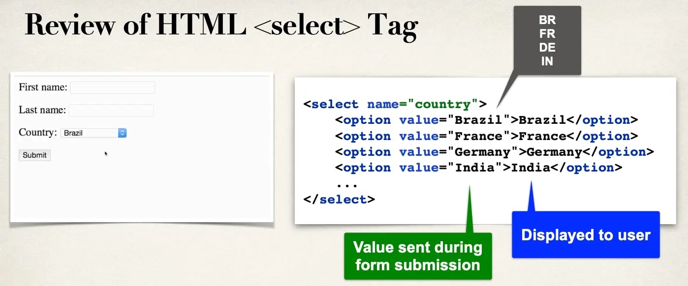

# Spring Boot - Spring MVC Form Data Binding - Drop-Down Lists - Overview



## Thymeleaf and `<select>` tag

```html
<select th:field="*{country}">
  <option th:value="Brazil">Brazil</option>
  <option th:value="France">France</option>
  <option th:value="Germany">Germany</option>
  <option th:value="India">India</option>
</select>
```

- `th:value="India"`: Value sent during form submission
- `>India</option>`: Shown to the user

## Development Process

1. Update HTML form
2. Update Student class - add getter/setter for new property
3. Update confirmation page
