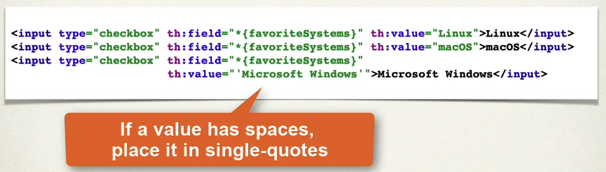

# Spring Boot - Spring MVC Form Data Binding - Check Boxes - Overview

## Code Example

## Development Process

1. Update HTML form
2. Update Student class - add getter/setter for new property
3. Update confirmation page
