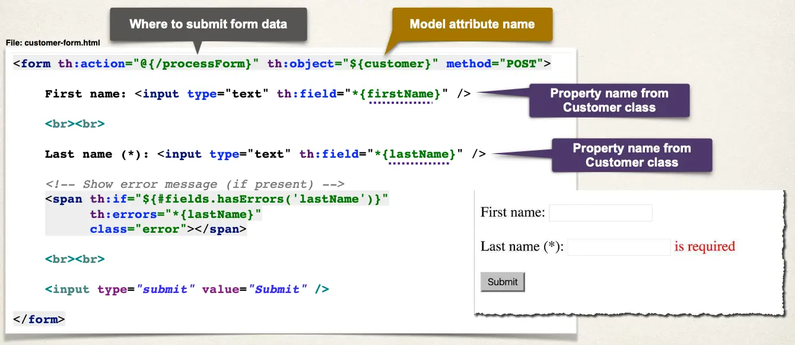
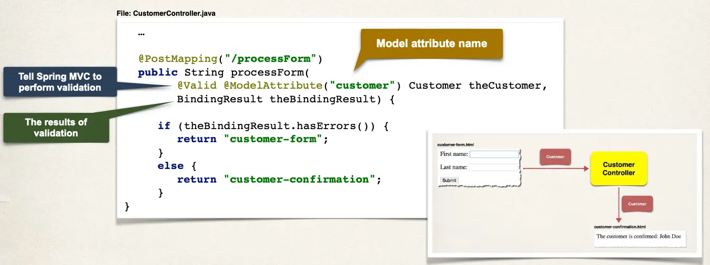

# Spring Boot - Spring MVC Validation - Required Fields - Overview

- We want to make the Last name field required

## Development Process

1. Create Customer class and add validation rules
2. Add Controller code to show HTML form
3. Develop HTML form and add validation support
4. Perform validation in the Controller class
5. Create confirmation page

## Step 1: Create Customer class and add validation rules

File `Customer.java`:

```java
import jakarta.validation.constraints.NotNull;
import jakarta.validation.constraints.Size;

public class Customer {

    private String firstName;

    @NotNull(message = "is required")
    @Size(min=1, message = "is required")
    private String lastName = "";

    // getter/setter methods …

}
```

## Step 2: Add Controller code to show HTML form

Model allows us to share information between Controllers and view pages (Thymeleaf)

- Name: `customer`
- Value: `new Customer()`

```java
import org.springframework.stereotype.Controller;
import org.springframework.web.bind.annotation.GetMapping;
import org.springframework.ui.Model;

@Controller
public class CustomerController {

    @GetMapping("/")
    public String showForm(Model theModel) {

        theModel.addAttribute("customer", new Customer());

        return "customer-form";
    }

// ...

}
```

## Step 3: Develop HTML form and add validation support



## Step 4: Perform validation in Controller class



## Step 5: Create confirmation page

```html
<!DOCTYPE html>
<html xmlns:th="http://www.thymeleaf.org">
  <body>
    The customer is confirmed:
    <span th:text="${customer.firstName + ' ' + customer.lastName}" />
  </body>
</html>
```
