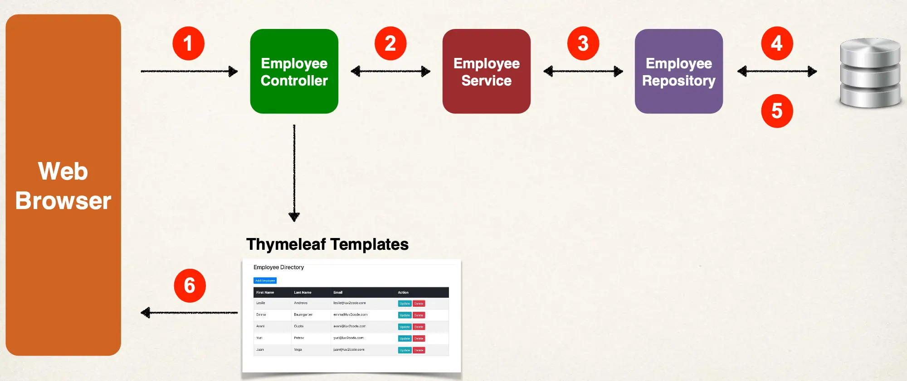
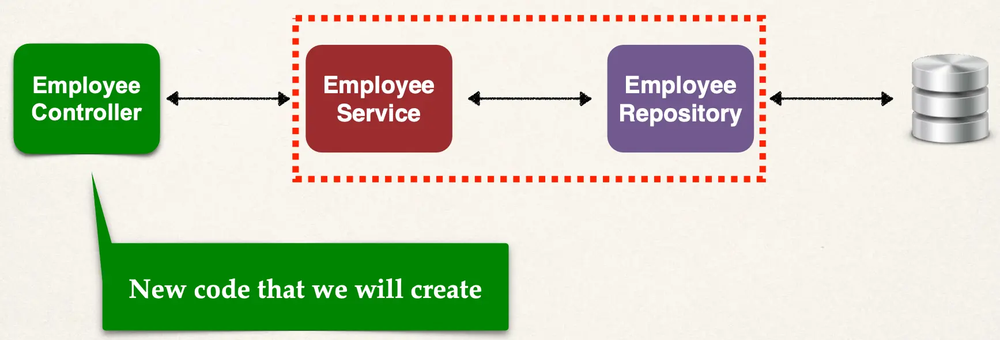

# CRUD Database Project - Overview

## Application Requirements

Create a Web UI for the Employee Directory. Users should be able to:

- Get a list of employees
- Add a new employee
- Update an employee
- Delete an employee

## Big Picture

## Application Architecture

We'll Reuse code from previous project

## Project Set Up

- We will extend our existing Employee project and add DB integration
- Add `EmployeeService`, `EmployeeRepository` and `Employee` entity
  - Available in one of our previous projects
  - We created all of this code already from scratch … so we'll just copy/paste it
- Allows us to focus on creating `EmployeeController` and Thymeleaf templates

## Development Process - Big Picture

1. Get list of employees
2. Add a new employee
3. Update an existing employee
4. Delete an existing employee
