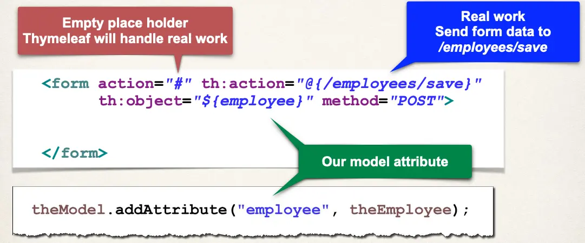

# CRUD Database Project - Add Employees - Overview

## Add Employee

1. New Add Employee button for `list-employees.html`
2. Create HTML form for new employee
3. Process form data to save employee

## Step 1: New "Add Employee" button

- Add Employee button will href link to
  - request mapping `/employees/showFormForAdd`

```html
<a th:href="@{/employees/showFormForAdd}" class="btn btn-primary btn-sm mb-3">
  Add Employee
</a>
```

## Showing Form

In your Spring Controller

- Before you show the form, you must add a **model attribute**
- This is an object that will hold form data for the **data binding**

### Controller code to show form

```java
@Controller
@RequestMapping("/employees")
public class EmployeeController {

    @GetMapping("/showFormForAdd")
    public String showFormForAdd(Model theModel) {

        // create model attribute to bind form data
        Employee theEmployee = new Employee();

        theModel.addAttribute("employee", theEmployee);

        return "employees/employee-form";
    }

    // ...
}
```

## Thymeleaf and Spring MVC Data Binding

- Thymeleaf has special expressions for binding Spring MVC form data
- Automatically setting / retrieving data from a Java object

### Thymeleaf Expressions

- Thymeleaf expressions can help you build the HTML form :-)

| Expression | Description                                          |
| ---------- | ---------------------------------------------------- |
| th:action  | Location to send form data                           |
| th:object  | Reference to model attribute                         |
| th:field   | Bind input field to a property on model attribute    |
| more ....  | See - https://www.luv2code.com/thymeleaf-create-form |

## Step 2: Create HTML form for new employee



The body of the form:

```html
<form
  action="#"
  th:action="@{/employees/save}"
  th:object="${employee}"
  method="POST"
>
  <input
    type="text"
    th:field="*{firstName}"
    placeholder="First name"
    class="form-control mb-4 w-25"
  />
  <input
    type="text"
    th:field="*{lastName}"
    placeholder="Last name"
    class="form-control mb-4 w-25"
  />
  <input
    type="text"
    th:field="*{email}"
    placeholder="Email"
    class="form-control mb-4 w-25"
  />
  <button type="submit" class="btn btn-info col-2">Save</button>
</form>
```

## Step 3: Process form data to save employee

```java
@Controller
@RequestMapping("/employees")
public class EmployeeController {

    private EmployeeService employeeService;

    public EmployeeController(EmployeeService theEmployeeService) {
        employeeService = theEmployeeService;
    }

    @PostMapping("/save")
    public String saveEmployee(@ModelAttribute("employee") Employee theEmployee) {
        // save the employee
        employeeService.save(theEmployee);

        // use a redirect to prevent duplicate submissions
        return "redirect:/employees/list";
    }
    // ...
}
```

"Post/Redirect/Get" pattern:

- For more info see https://www.luv2code.com/post-redirect-get
- Redirect to request mapping `/employees/list`
